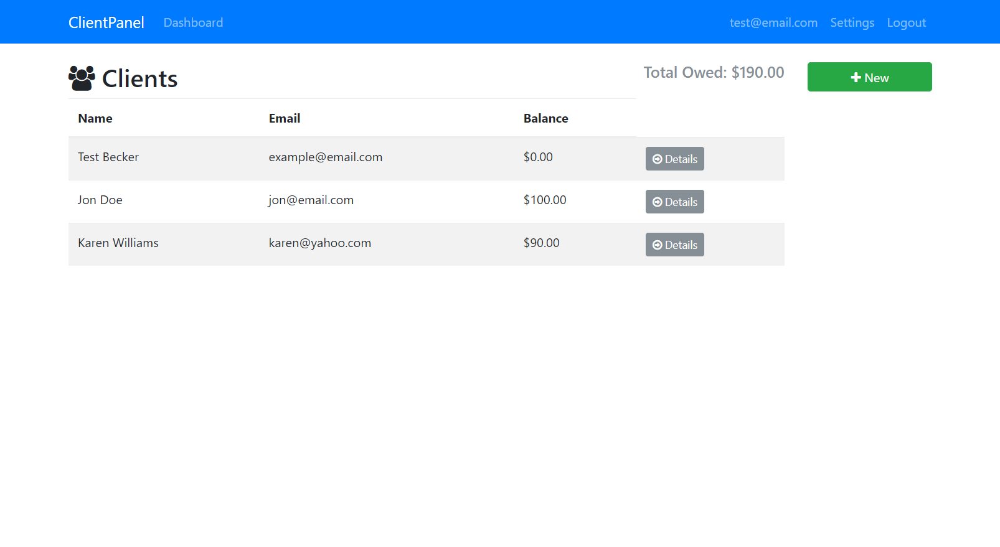
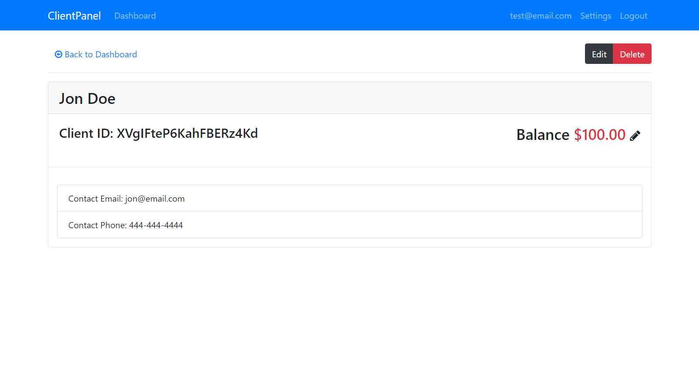
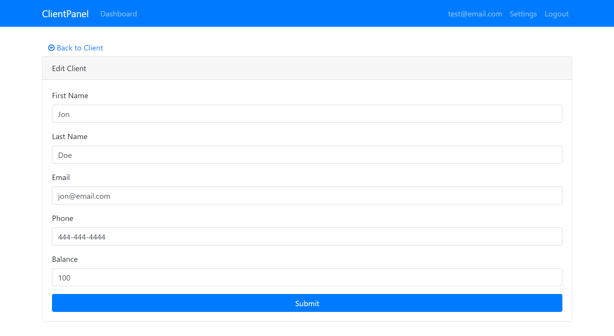
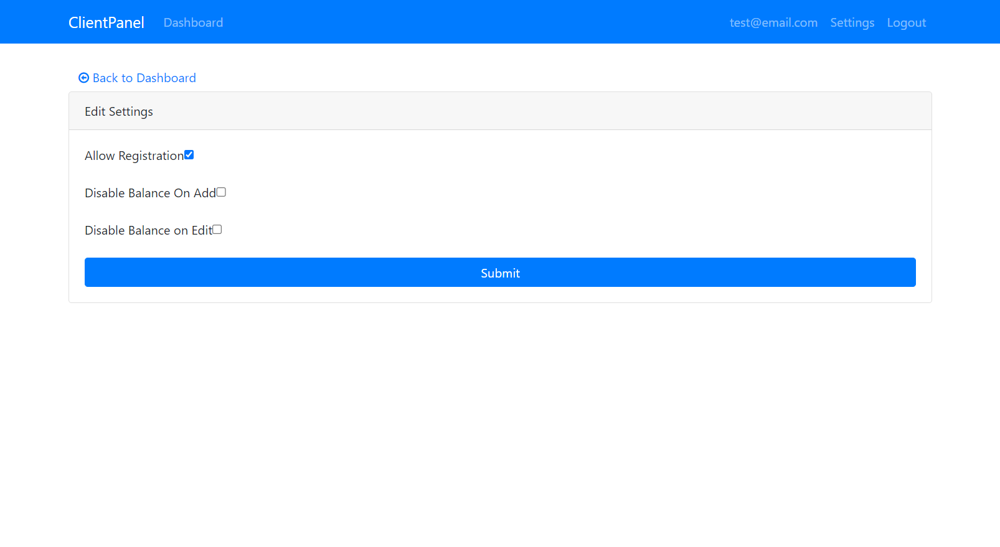

## Angular Sandbox App

## [Live Demo: ClientPanel App](https://clientpanel-app-gdbecker.netlify.app/login)

#### Dashboard

#### Client Details

#### Edit Client

#### Settings

### Project Details

Followed along with Brad to build the ClientPanel app. View all clients on the main dashboard home page, view client details and from there have the option to either edit or delete the client. You can also add a new client from the home page, and change global app settings from the link. Uses Firebase for the database and authentication to register, login, and logout users.

### Test it out!

#### User login

- email: test@gmail.com
- password: Password123

### App Notes

#### globally install Angular CLI

- npm install -g @angular/cli

#### Set up Angular project

- ng new --no-standalone clientpanel

#### Add environments folder manually with CLI

- ng g environments

#### npm packages

- bootstrap@4.0.0-beta.2
- font-awesome
- jquery
- popper.js
- firebase
- angularfire2 -> now it's: @angular/fire
