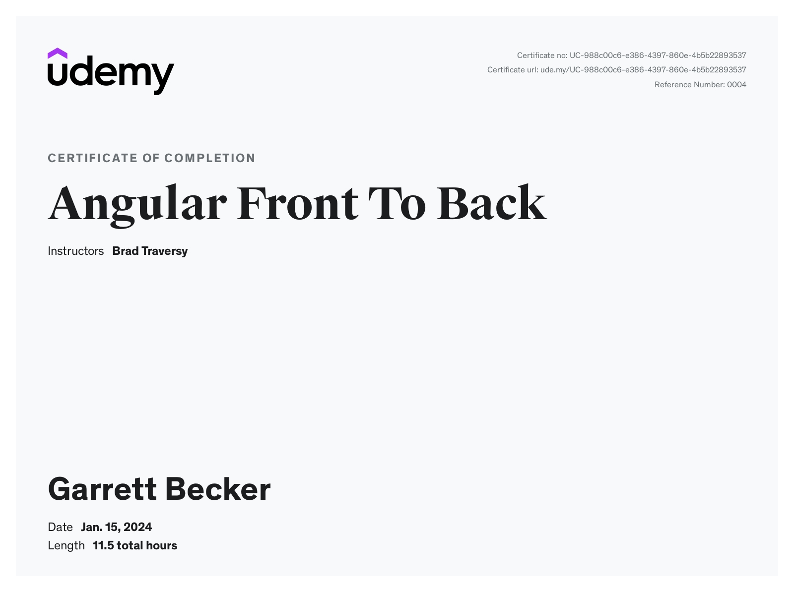

# Udemy - Angular Front to Back

Projects and learning from Brad Traversy's [Angular Front to Back course on Udemy](https://www.udemy.com/course/angular-4-front-to-back/).

### [Certificate](https://www.udemy.com/certificate/UC-988c00c6-e386-4397-860e-4b5b22893537/)

### Course Details

#### What you'll learn
- Build amazing single page applications using Angular 5+
- Master Angular concepts
- Understand the file and folder structure of an Angular application
- Build a client management application with authentication and Firebase's Firestore
- Integrate Bootstrap 4 into Angular projects

#### Requirements
- You should have a basic understanding of HTML and JavaScript

#### Description
This course was crafted to benefit absolutely any level of developer. We will start from scratch and learn how to create a development environment for Angular 5+, Setup Angular CLI and learn all of the fundamentals. We start by building a sandbox application to look at all of the main Angular concepts as well as building a logging application, then move to a much more advanced client management system with authentication and data storing with Firebase's new Firestore platform.

Here are some of the things you will learn about in this course:

- What is Angular?
- Dev Environment Setup Including Node.js, Visual Studio Code & Git Bash
- Angular CLI Setup & Build
- File Structure & Dependency Examination
- TypeScript Intro
- Components
- Modules & NgModule
- Data Binding & String Interpolation
- Types & Interfaces
- Template Syntax
- ngIf & ngFor Conditional Directives
- ngFor & Loops
- Property Binding, ngClass & ngStyle
- Pipes
- Events & Forms
- ngModel & 2 Way Binding
- Services
- Observables & Http
- Angular Router
- Firebase, Firestore & AngularFire2
- Flash Messaging
- Much More!!

#### Who this course is for:
- Anyone that wants to learn Angular 5+