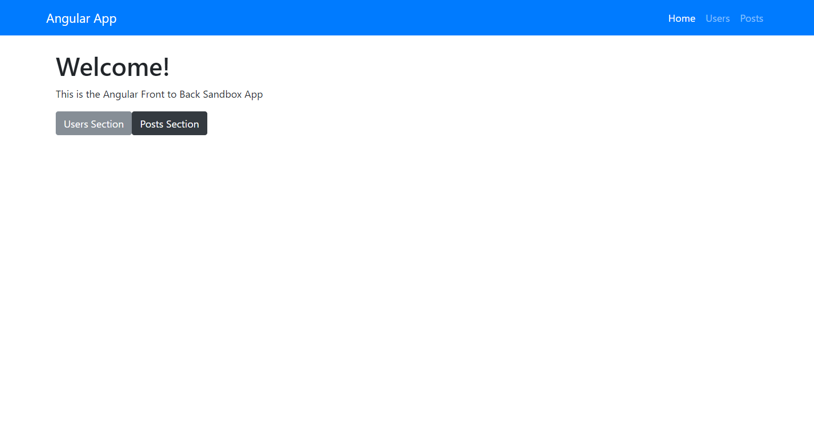
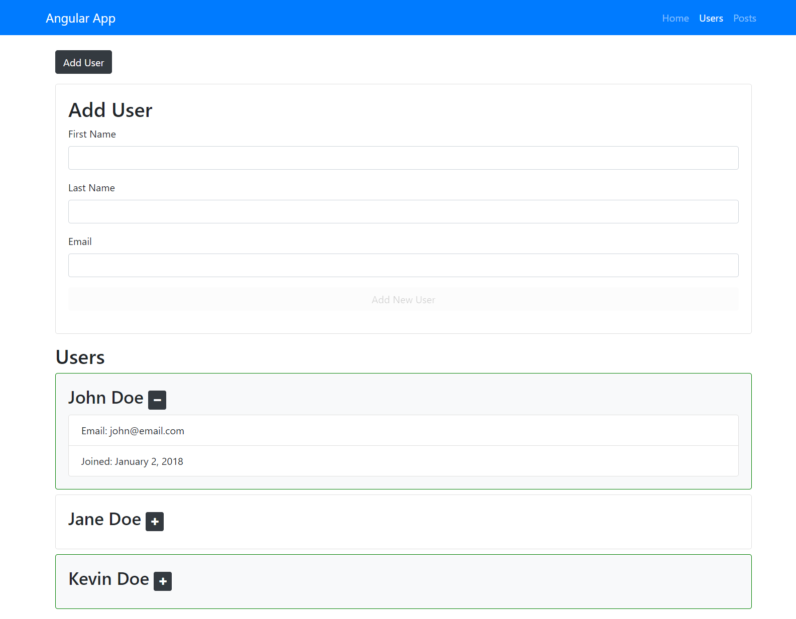
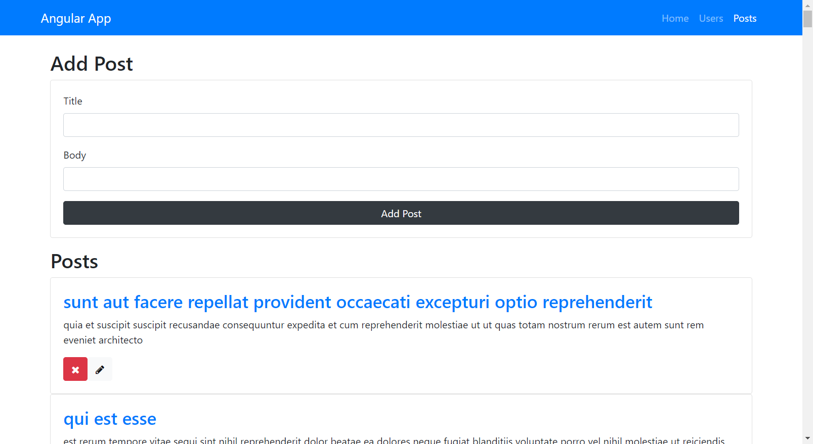

## Angular Sandbox App

## [Live Demo: Sandbox App](https://sandbox-app-gdbecker.netlify.app)

#### Home Page

#### Users Page

#### Posts Page

### Project Details

Reference Angular app, built to cover different aspects of Angular's framework and key features.

### Notes

### What is Angular?

- Frontend JavaScript framework
- Created and maintained by Google
- Used to build powerful front-end applications
- Part of the very powerful MEAN stack
  - MEAN = MongoBD, Express.js, Angular, Node.js
- Angular and AngularJS are NOT the same

### Why use Angular?

- Rapid development and code generation
- Code organization and productivity
- Dynamic content
- Cross platform
- Unit testing ready
- Core features include but not limited to:
  - Components, Data Binding, Directives, Services, Templating, Pipes, Routing, HTTP Module, Dependency Injection, Testing, Observables, Animation, Build Tools, Forms Module, TypeScript

### Ways to install and setup Angular

- Angular CLI
- Quickstart seeds
- From absolute scratch

### Making a new Angular app v14+

- ng new --no-standalone <project_name>
  - Using "--no-standalone" will create the app.module.ts file

### Angular dependencies

- Node.js and NPM

### Major Version History

- AngularJS / Angular 1
  - Released in 2010
  - Competed with Ember, Backbone.js, etc
  - Used controllers and scope
- Angular 2
  - Released in 2015
  - Complete re-write of the framework
  - Controllers and scope are out
  - Components are in
  - Pissed off devs
- No Angular 3 because of misalignment of router package from the other packages
- Angular 4
  - Released in 2017
  - Just called "Angular" from now on
  - Backward compatible with Angular 2
  - Reduced size / more compact / faster compile
  - Most changes were under the hood
- Angular 5
  - Backward compatible with 2 and 4
  - Most changes were under the hood
  - Most focus on speed and size
  - New HTTP module (the old one is deprecated but can still be used)
  - Changes with pipes
- Angular 6, 7 + (to be released)

### What is TypeScript?

- A superset of JavaScript created by Microsoft
- Compiles to plain JavaScript code
- Gives us a bunch of extra features
- Includes many ES6+ features

### TypeScript Features

- Static typing
- Object classes
- Modules
- let/const scoping
- Other ES6+ features

### TypeScript Compiler

- Written in TypeScript
- Compiles .ts files to .js files
- Installed with NPM
- Supports ES6+ syntax
- Used by Angular

### Static Type Checking

- Assign variable, parameter, and function types
- Completely optional
- Helps find bugs
- More descriptive code

### Available types

- String
- Boolean
- Number
- Array
- Any
- Void
- Null
- Tuple

### What is a component?

- The bulk of an Angular app
- Pieces of UI
- Include a class and a template
- Bind from class -> template and class <- template

### Why use components?

- Code organization
- Break up the UI
- Contain properties and methods
- Promotes reusability
- Better teamwork

### Generating components with the Angular CLI

- ng g component components/my-component
- ng g c components/my-comp --skip-tests

### What is a service?

- Classes that can send functionality and data across multiple components
- Keeps components lean
- DRY = Don't Repeat Yourself
- Ideal place for Ajax calls using the Http module

### Steps to create a service

- Create a new file /services/my-service.service.ts
- Import @Injectable and create class
- Add as a provider to @ngModule
- Call from component(s)

### Generating services with Angular CLI

- ng g service services/my-service
- ng g s services/my-service
- ng g s services/my-service --module=app.module
  - creates service file and class
  - add the "module=app.module" flag to automatically add as a provider

### What does the router do?

- Handles navigation from one component to another
- Mimics loading separate pages via browser
- Includes back button functionality
- Most Angular apps are SPA

### Basics steps to take

- Create app-routing module
- Import RouterModule
- Create routes
- Router outlet
- Add links
