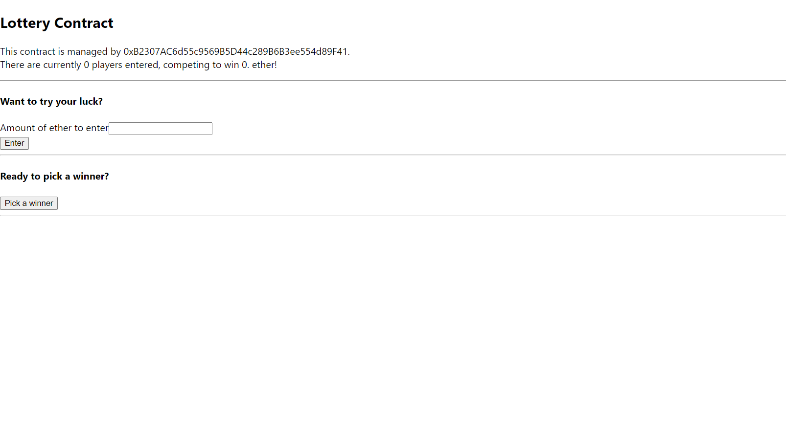

## Section 04 - Building Interactive Frontends

## [Live Demo: Lottery Contract with React]()

#### Home Page

Connecting our Lottery smart contract from the previous section with a basic React frontend.

### Lottery Contract with React Project Notes
- For this Lottery frontend project, we are assuming that the user already has Metamask installed in their browser
- Process
  - Component renders
  - componentDidMount called
  - 'Call' methods on contract
  - Set data on 'state'