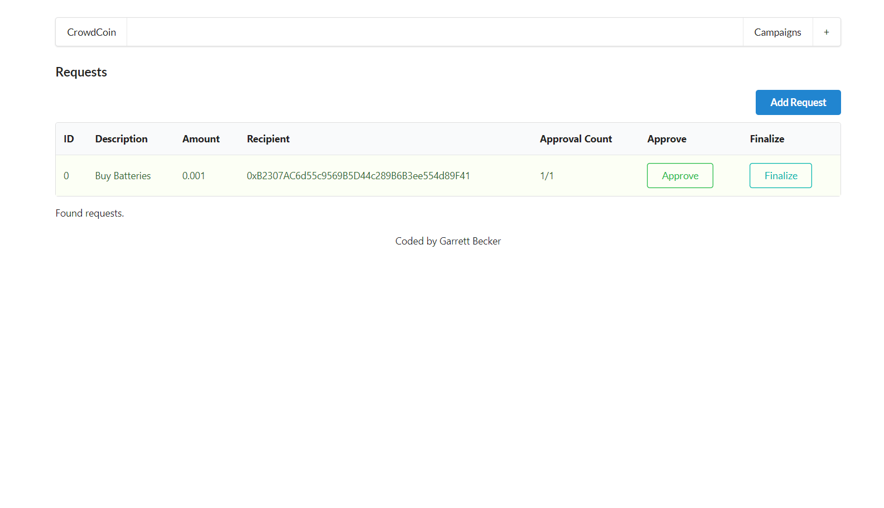

## Section 07 - Advanced Multi-Page Frontends

## [Live Demo: CrowdCoin Contract with Next]()

#### Home Page

#### Campaign Details

#### Requests Page

Connecting our Kickstart smart contract from the previous section with Next.js for a fully developed frontend app. Rebranded as CrowdCoin - jump here to add a new campaign, send donations, add requests, approve and finalize all here!

### Routing for CrowdCoin App
|Path|We should show...|
|-|-|
|/|List of campaigns|
|/campaigns/new|Form to make a campaign|
|/campaigns/0x892hw3|Campaign details for campaign at address 0x892hw3|
|/campaigns/0x892hw3/requests|Requests for campaign at address 0x892hw3|
|/campaigns/0x892hw3/requests/new|Form to create a request for campaign at address 0x892hw3|

### Next.js
- Wraps up React + associated tools into one package
- Lots of fancy features included out of the box
  - Routing
  - Server side rendering
  - Hot module reload
- Makes it really easy to use React to make a multi-page app