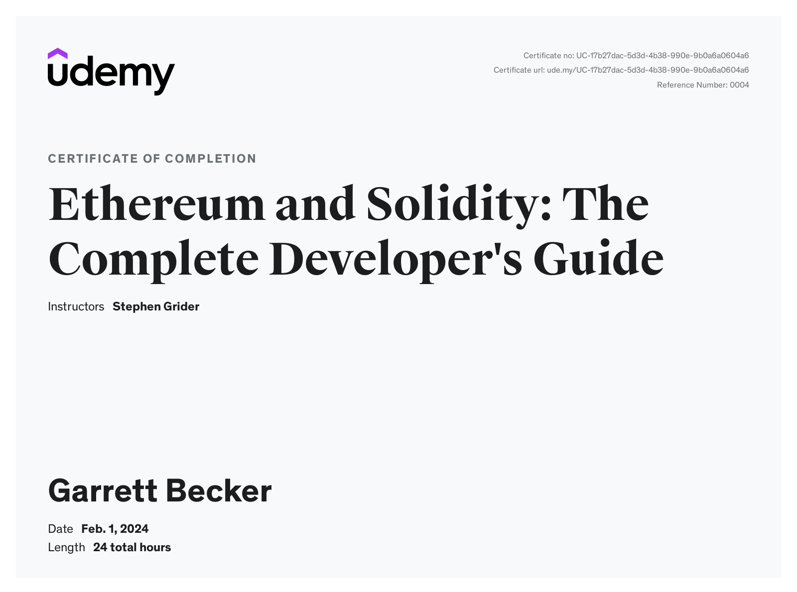

# Udemy - Ethereum and Solidity: The Complete Developer's Guide

Projects and learning from Stephen Grider's [Ethereum and Solidity: The Complete Developer's Guide course on Udemy](https://www.udemy.com/course/ethereum-and-solidity-the-complete-developers-guide/).

### [Certificate](https://www.udemy.com/certificate/UC-17b27dac-5d3d-4b38-990e-9b0a6a0604a6/)

