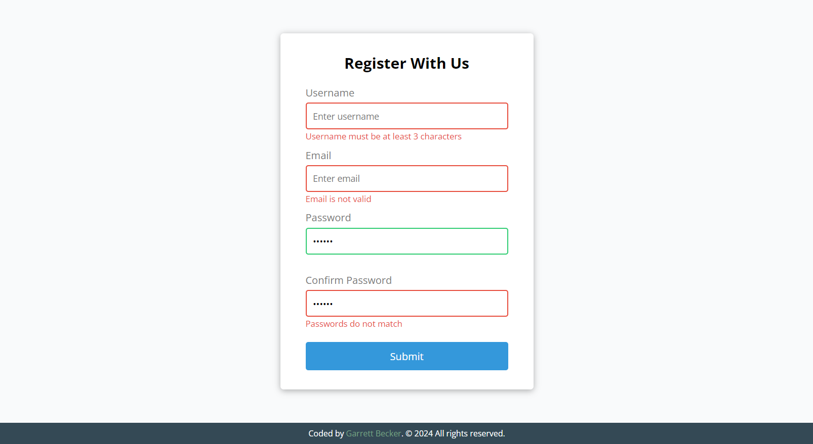

## 01_ Form Validator

Simple client side form validation. Check required, length, email and password match

## [Live Demo: Form Validator](https://01-form-validator-gdbecker.replit.app/)

### Preview

### Tools
- HTML
- CSS
- Vanilla JavaScript

### Specifications
- Create form UI
- Show error messages under specific inputs
- checkRequired() to accept array of inputs
- checkLength() to check min and max length
- checkEmail() to validate email with regex
- checkPasswordsMatch() to match confirm password