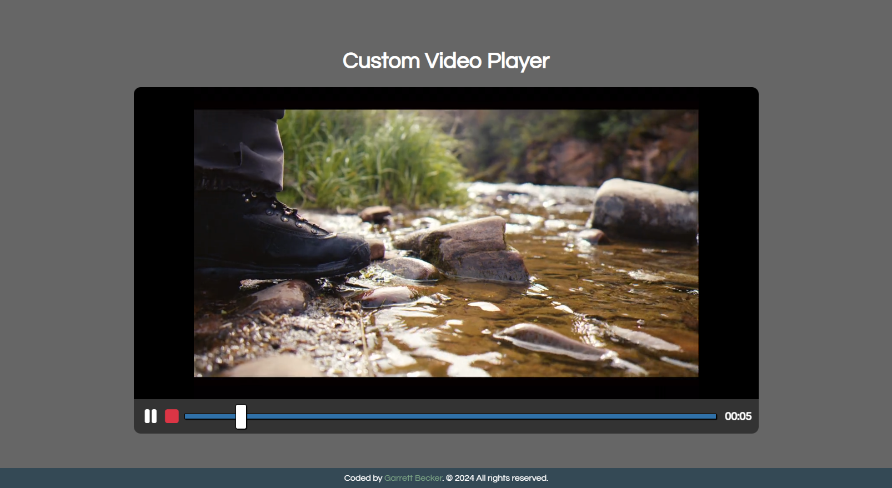

## 03_ Custom Video Player

Custom video player using the HTML5 video element and it's JavaScript API with a custom design

## [Live Demo: Custom Video Player](https://03-custom-video-player-gdbecker.replit.app/)

### Preview

### Tools
- HTML
- CSS
- Vanilla JavaScript

### Specifications
- Display custom video player styled with CSS
- Play/pause
- Stop
- Video progress bar
- Set progress bar time
- Display time in mins and seconds