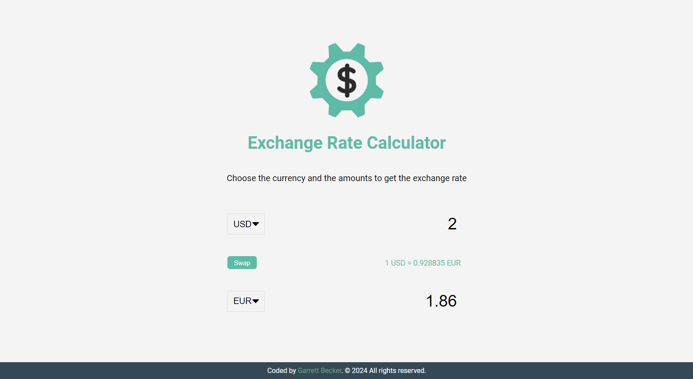

## 04_ Exchange Rate Calculator

Select countries to get the exchange rate for a specific amount

## [Live Demo: Exchange Rate Calculator]()

### Preview

### Tools
- HTML
- CSS
- Vanilla JavaScript

### Specifications
- Display UI with 2 select lists for countries and 2 inputs for amounts
- Fetch exchange rates from API (https://api.exchangerate-api.com)
- Display the values for both countries
- Update values on amount change
- Swap country rates