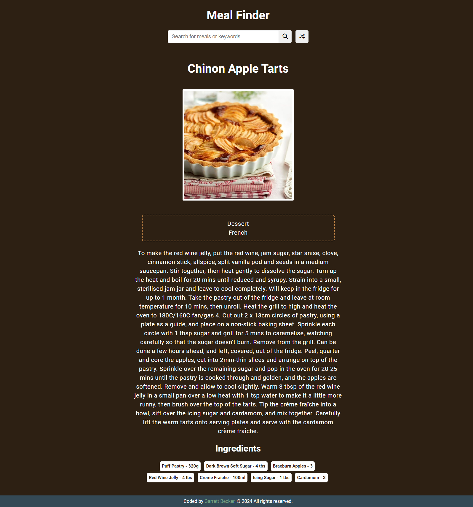

## 08_ Meal Finder App

Search and generate random meals from the [themealdb.com](https://themealdb.com) API

## [Live Demo: Meal Finder App]()

### Preview

### Tools
- HTML
- CSS
- Vanilla JavaScript
- [themealdb.com](https://themealdb.com) API

### Specifications
- Display UI with form to search and button to generate
- Connect to API and get meals
- Display meals in DOM with image and hover effect
- Click on meal and see the details
- Click on generate button and fetch & display a random meal