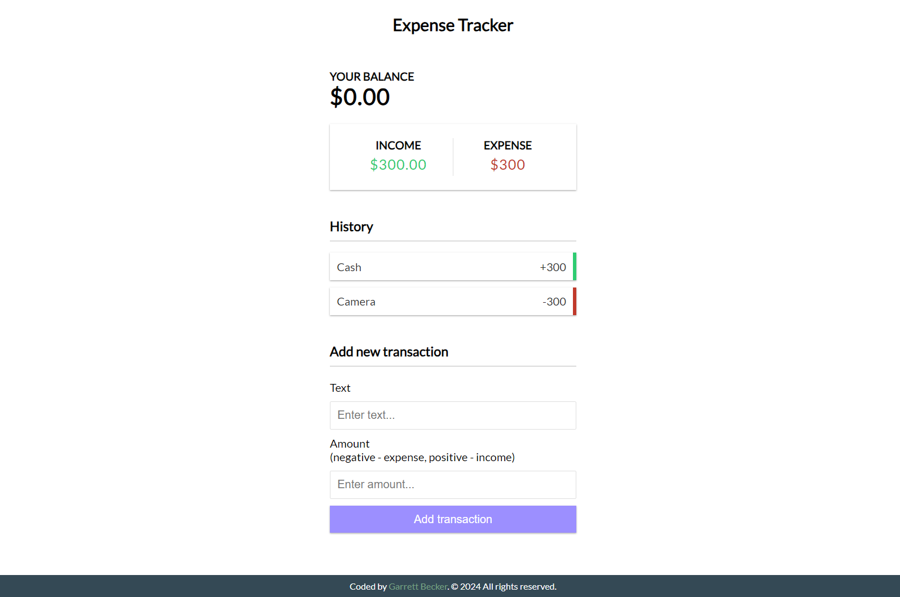

## 09_ Expense Tracker

Keep track of income and expenses. Add and remove items and save to local storage

## [Live Demo: Expense Tracker]()

### Preview

### Tools
- HTML
- CSS
- Vanilla JavaScript

### Specifications
- Create UI for project
- Display transaction items in DOM
- Show balance, expense and income totals
- Add new transation and reflect in total
- Delete items from DOM
- Persist to local storage