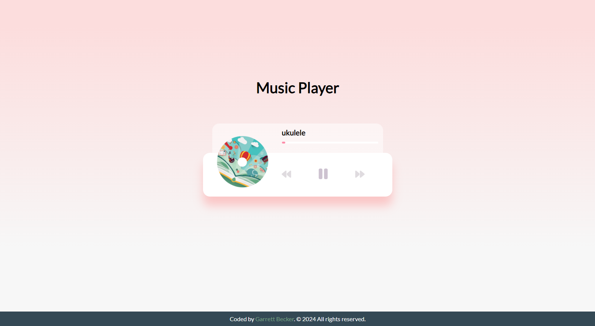

## 10_ Music Player

Create beautiful UI to play music stored in the "music folder" using the HTML5 audio API

## [Live Demo: Music Player](https://10-music-player-gdbecker.replit.app/)

### Preview

### Tools
- HTML
- CSS
- Vanilla JavaScript

### Specifications
- Create UI for music player including spinning image and song detail popup
- Add play and pause functionality
- Switch songs
- Progress bar