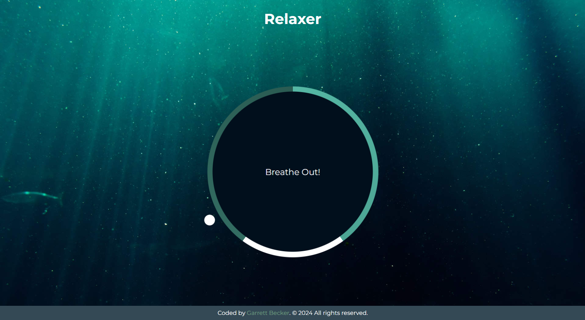

## 16_ Relaxer App

A relaxing breathing app with a visual director to tell you when to breathe in, hold and breathe out

## [Live Demo: Relaxer App](https://16-relaxer-app-gdbecker.replit.app/)

### Preview

### Tools
- HTML
- CSS
- Vanilla JavaScript

### Specifications
- Create circle and gradient circle with CSS
- Create and animate pointer (Small circle)
- Create grow and shrink animations
- Add JavaScript to create the breath animation effect