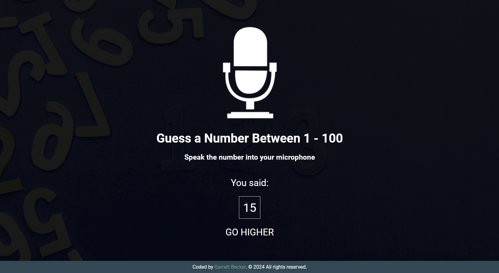

## 19_ Speak Number Guessing Game

Number guessing game where you speak your guess into the microphone using the speech recognition API

## [Live Demo: Speak Number Guessing Game]()

### Preview

### Tools
- HTML
- CSS
- Vanilla JavaScript
- Speech recognition API

### Specifications
- Display UI directing user to speak guess
- Implement speech recognition to listen to mic
- Process user's guess and match
- Let user know higher, lower, match or not a number