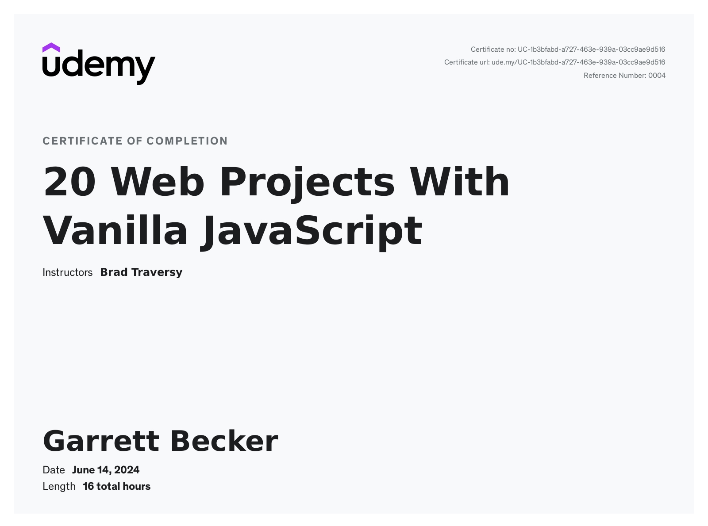

# Udemy - 20 Web Projects With Vanilla JavaScript

Projects and learning from Brad Traversy's [20 Web Projects With Vanilla JavaScript course on Udemy](https://www.udemy.com/course/web-projects-with-vanilla-javascript/).

### [Certificate](https://www.udemy.com/certificate/UC-1b3bfabd-a727-463e-939a-03cc9ae9d516/)

### Course Details

#### What you'll learn
- Build 20 Frontend Projects From Scratch
- No JS or CSS Frameworks
- Modern JavaScript (ES6+) - Arrows, Fetch, Promises, etc
- DOM Manipulation & Events
- Animations With CSS & JavaScript
- Fetch & JSON With 3rd Party API's
- HTML5 Canvas, Speech API, Audio & Video
- Beginner Friendly

#### Requirements
- Basic knowledge in HTML, CSS & JavaScript

#### Description
This is a fun, practical & project based course for all skill levels. The projects in this course are designed to get you building things using HTML5, CSS &  JavaScript with no frameworks or libraries. Every project is built from scratch and has some kind of dynamic functionality from small games to an expense tracker to a breathing relax app.

Although this is a project based course, I will still be explaining everything as I go. These are mini-projects designed for you to complete in a few hours.

You should have some basic knowledge of HTML/CSS/JS. If you are brand new, I would suggest my Modern HTML/CSS From The Beginning and/or my Modern JS From The Beginning courses on Udemy. This course is a mix of both.

Some Things You Will Learn In These Projects:
- Create Layouts & UI's With HTML/CSS ( No CSS Frameworks )
- CSS Animations (Transitions, Keyframes, etc With JS Triggers)
- JavaScript Fundamentals
- DOM Selection & Manipulation
- JavaScript Events (Forms, buttons, scrolling, etc)
- Fetch API & JSON
- HTML5 Canvas
- The Audio & Video API
- Drag & Drop
- Web Speech API (Syth & Recognition)
- Working with Local Storage
- High Order Array Methods - forEach, map, filter, reduce, sort
- setTimout, setInterval
- Arrow Functions

#### Who this course is for:
- Anyone that wants to build some fun and easy to intermediate projects
