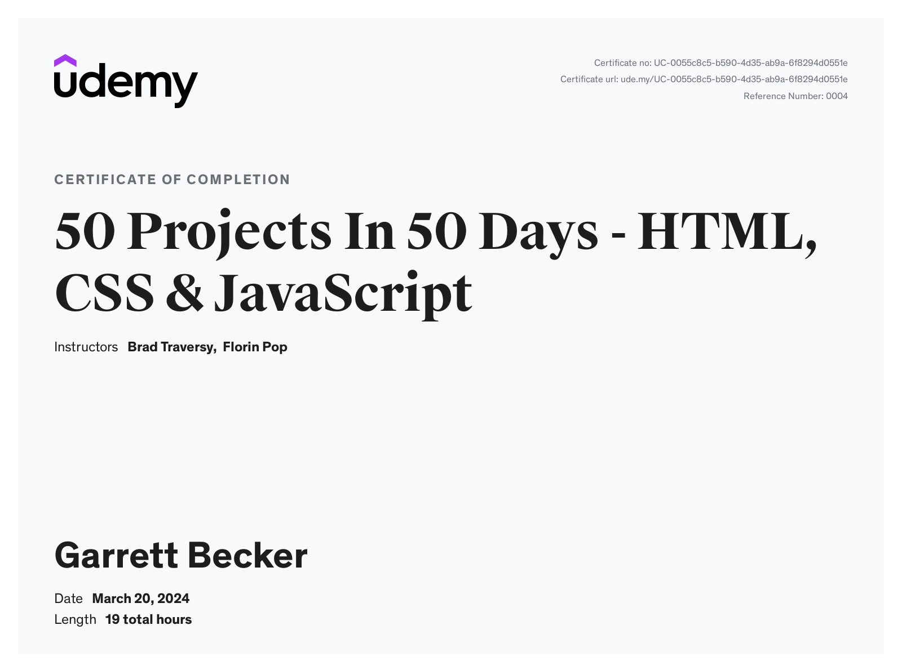

# Udemy - 50 Projects In 50 Days - HTML, CSS & JavaScript

Projects and learning from Brad Traversy's [50 Projects In 50 Days - HTML, CSS & JavaScript course on Udemy](https://www.udemy.com/course/50-projects-50-days/).

### [Certificate](https://www.udemy.com/certificate/UC-0055c8c5-b590-4d35-ab9a-6f8294d0551e/)

### [Live Demo: Links to All Projects](https://50-projects-50-days-gdbecker.replit.app/)

### Course Details

#### What you'll learn
- Project based teaching to sharpen your HTML, CSS & JavaScript skills
- Perfect for beginners looking for things to build unique projects in a short timeframe
- Modern styling with flexbox, CSS animations, custom properties, etc
- DOM manipulation, events, array methods, HTTP requests & more

#### Requirements
- A very basic understanding of HTML, CSS & JavaScript

#### Description
This is a purely project-based course. It is geared toward beginners, but intermediate developers can also enjoy creating new things. This course includes 50 mini projects in HTML, CSS & JavaScript that relate to the DOM (Document Object Model). Here is a list of what we will create in this course:
1. Expanding Cards
2. Progress Steps
3. Rotating Navigation Animation
4. Hidden Search Widget
5. Blurry Loading
6. Scroll Animation
7. Split Landing Page
8. Form Wave
9. Sound Board
10. Dad Jokes
11. Event Keycodes
12. Faq Collapse
13. Random Choice Picker
14. Animated Navigation
15. Incrementing Counter
16. Drink Water
17. Movie App
18. Background Slider
19. Theme Clock
20. Button Ripple Effect
21. Drag N Drop
22. Drawing App
23. Kinetic Loader
24. Content Placeholder
25. Sticky Navbar
26. Double Vertical Slider
27. Toast Notification
28. Github Profiles
29. Double Click Heart
30. Auto Text Effect
31. Password Generator
32. Good Cheap Fast
33. Notes App
34. Animated Countdown
35. Image Carousel
36. Hoverboard
37. Pokedex
38. Mobile Tab Navigation
39. Password Strength Background
40. 3d Background Boxes
41. Verify Account UI
42. Live User Filter
43. Feedback UI Design
44. Custom Range Slider
45. Netflix Mobile Navigation
46. Quiz App
47. Testimonial Box Switcher
48. Random Image Feed
49. Todo List
50. Insect Catch Game

Many people jump into a frontend framework too early. Learning vanilla JavaScript and understanding how the document object model works are essential before moving to a framework. This course teaches you this by creating real-world projects of all types.

You will also learn more about HTML5 and CSS including semantic tags in your markup, basic CSS properties such as colors, alignment, flexbox, and shadows as well as creating responsive layouts with CSS media queries, CSS custom properties, animations/transitions, and more.

50 projects may seem like a lot, but we were able to make them small enough to where you can complete a project in just a few hours. Of course, this depends on your skill level.

#### Who this course is for:
- Beginner and intermediate web developers that want to build fun, unique projects with HTML, CSS & JavaScript
