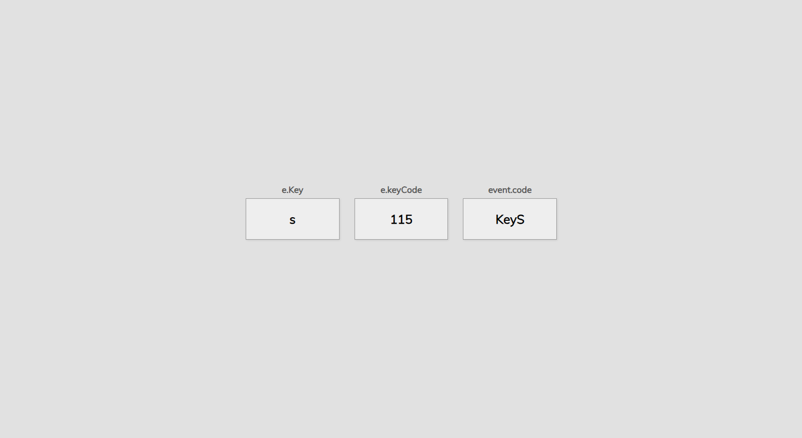

## 05 - Key-Code Mini Project

### [Live Demo](https://js-keycode-project-gdbecker.netlify.app/)

- Mini project to test using keyboard events
- Takes the key pressed by the user and populates the div elements with key, keyCode, and code
