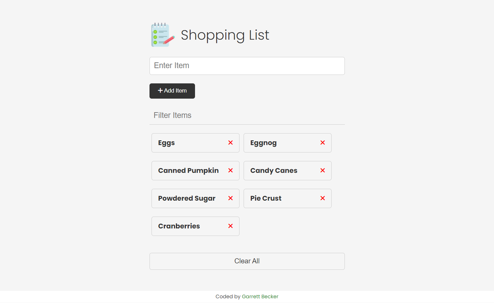

# Shopping List Project

## [Live Demo](https://js-shopping-list-gdbecker.netlify.app/)

Vanilla JavaScript shopping list app from my Modern JS From The Beginning course.

This project was created to focus on working with the DOM, events, state, local storage and other fundamentals of JavaScript.

### Project Specs

- Add items to list via form
- Remove items from list by clicking the "X" button
- Clear items with "clear" button
- Filter the items by typing into the filter field
- Add localStorage to persist items
- Click on an item to put into "edit mode" and add to form"
- Update item
- Deploy to Netlify

### localStorage / sessionStorage

- Property on the `Window` interface that allows us to access a Storage object
- Data is stored in the browser
- Data is stored as key/value pairs and values are strings (can not store objects)
- localStorage and sessionStorage have the same API. The difference is that localStorage does not expire, while sessionStorage only lasts until the page is closed

### localStorage Methods

- localStorage.setItem('name', 'Garrett);
- localStorage.getItem('name');
- localStorage.removeItem('name');
- localStorage.clear();
