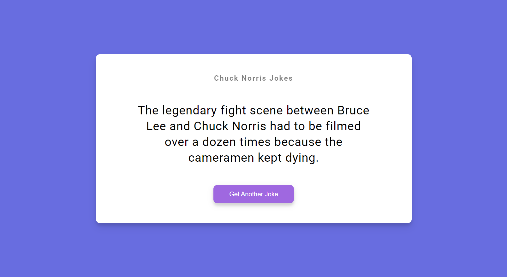

## 05 - Joke Generator Project Challenge

### [Live Demo](https://js-joke-generator-challenge-gdbecker.netlify.app/)

In the last video, we saw how to make a request to an API using the `XMLHttpRequest` object. In this video, we'll use the same technique to make a request to the [https://api.chucknorris.io/](https://api.chucknorris.io/) to get a random Chuck Norris joke and put it into the page. We will also create a button that will allow us to get a new joke.

Before I move on, I would like to challenge you to create this yourself without having to follow along. We went over everything that you need to know already. In the resources for this video, you'll find the 'chuck-joke-generator`folder with the HTML and CSS along with an empty 'script.js'` file. You just need to do the following:

- Add an event listener for the button
- Create a function that will make a request to https://api.chucknorris.io/jokes/random using the `XMLHttpRequest` object
- Get the data that is sent back (this.responseText), parse the JSON and get the joke from it
- Display the joke in the page (you can use the `innerHTML` property)

And that's it. We now have a Chuck Norris joke generator. You can see the final code in the `chuck-joke-generator-final` folder in the resources for this video.
