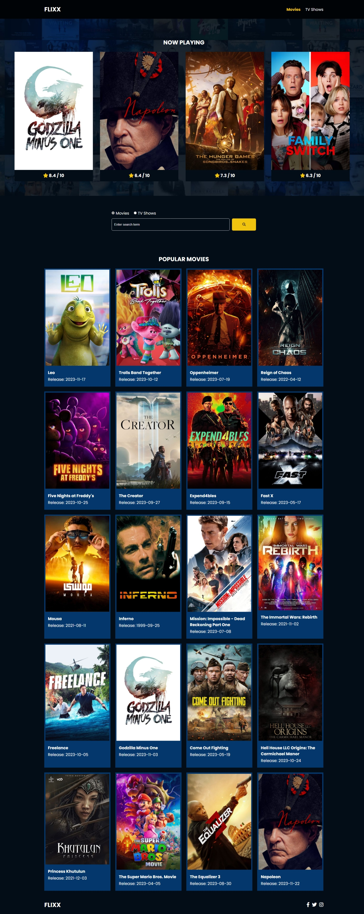

## Flixx Movie App Project

### Project Overview

Vanilla JavaScript-powered complete app for exploring movies and tv shows! Take a look at the twenty most popular movies rom TMDB, as well as a quick glance of current releases in theaters and on streaming. You can dig into each movie or show's details with a click to a separate page, as well as view paginated search results from the search bar.

### Key Features Built

- Page routing
- Active page highlighted in the navbar
- Populating movie and tv show cards and detail pages with TMDB API data
- Display paginated search results up to twenty at a time

### TMDB Movies/TV Shows API

- Documentation
  - https://developer.themoviedb.org/reference/intro/getting-started
