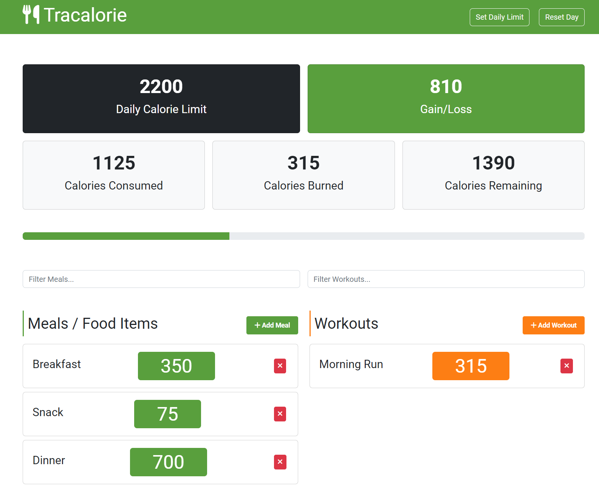

# Tracalorie App V2 with Webpack

## [Live Demo](https://js-tracalorie-v2-gdbecker.netlify.app/)

### Project Details

This is a refactored version of the first Tracalorie app - now configured with Webpack!

Full stack application built entirely with vanilla JavaScript! Set your daily calorie limit with the form button at the top. Add meals & workouts as you go about your day to keep track of where you stand on your calories and how well you're doing. If you made a mistake somewhere you can easily delete meals or workouts, and dynamically filter down your content with separate filter bars. At the start of a new day click on the reset button up top to refresh everything.

### Topics and Skills Covered

- OOP structure for all content (CalorieTracker, Meal, Workout, Storage, App)
- Adding/removing/filtering meals and workouts
- Setting your daily calorie limit
- Reset calories consumed, meals and workouts
- Uses localStorage as the data storage
- Event listeners to keep track of clicks, keyups, and submits
- Webpack module bundling
