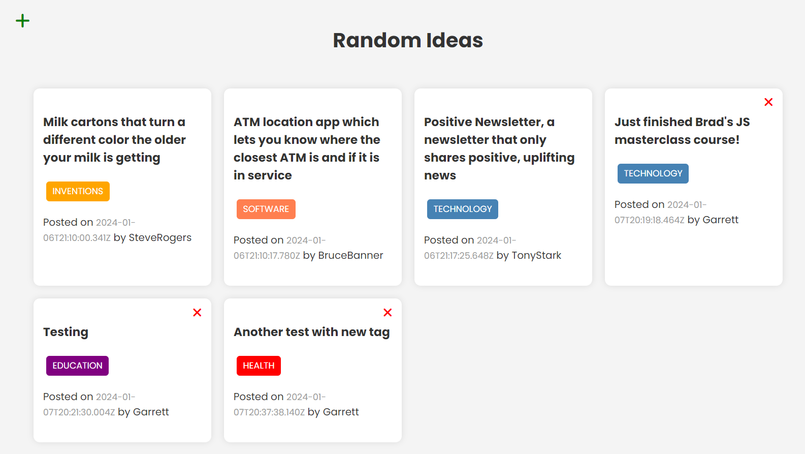

## Section 22: RandomIdeas App - Webpack Frontend

## [Live Demo: Random Ideas App](https://replit.com/@gdbecker/RandomIdeasApp)

### Project Details

Full stack application built entirely with a vanilla JavaScript, CSS, and HTML frontend, and also with a Node.js and Express.js backend utilizing Webpack infrastructure and a MongoDB database. Jot down ideas you have in different categories such as inventions, technology, health, and more, record with your username and see other public ideas other users have. Your session saves your username so only you will be able to delete the ideas you publish. All data is persisted to a MongoDB Atlas database.

### Topics and Skills Covered

- OOP structure for all content (Ideas form, and list of ideas)
- Adding and removing ideas
- Persist all data to and from a MongoDB Atlas database
- The ideas form saves your username based on your browser session in localStorage
- Webpack infrastructure for frontend design and build

### Deployment Steps

- Use Font Awesome CDN to prevent size warning
- Change mode to 'production' in webpack
- Change the \_apiUrl and add proxy to webpack config
- Run 'npm run build'
- Push to GitHub
- Register at render.com, and create new project and select your repo
- Create the env variable for MONGO_URI on render.com
- Add the host IP address to MongoDB Atlas network access
