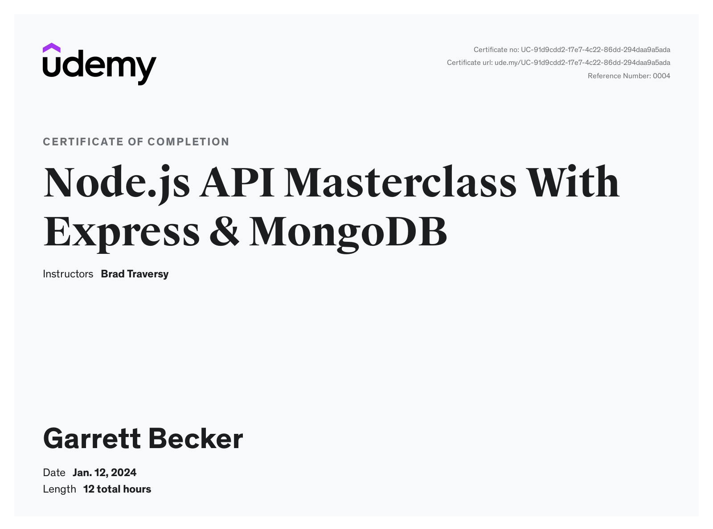

# Udemy - Node.js API Masterclass

Projects and learning from Brad Traversy's [Node.js API Masterclass course on Udemy](https://www.udemy.com/course/nodejs-api-masterclass/).

### [Certificate](https://www.udemy.com/certificate/UC-91d9cdd2-17e7-4c22-86dd-294daa9a5ada/)

### Course Details

#### What you'll learn
- Real World Backend RESTful API For Bootcamp Directory App
- HTTP Fundamentals (Req/Res Cycle, Status Codes, etc)
- Advanced Mongoose Queries
- JWT/Cookie Authentication
- Express & Mongoose Middleware (Geocoding, Auth, Error Handling, etc)
- API Security (NoSQL injection, XSS protection, Rate Limiting)
- API Documentation & Deployment

#### Requirements
- Modern JavaScript (ES6)
- Basic programming principles
- Basic knowledge of Node helps

#### Description
This is a project based course where we build an extensive, in-depth backend API for DevCamper, a bootcamp directory API. We will start from scratch and end up with a professional deployed API with documentation. We will dive deep into Node, Express and MongoDB. Here is some of what you will learn in this course and project...
- HTTP Essentials
- Postman Client
- RESTful APIs
- Express Framework
- Routing & Controller Methods
- MongoDB Atlas & Compass
- Mongoose ODM
- Advanced Query (Pagination, filter, etc)
- Models & Relationships
- Middleware (Express & Mongoose)
- MongoDB Geospatial Index / GeoJSON
- Geocoding
- Custom Error Handling
- User Roles & Permissions
- Aggregation
- Photo Upload
- Authentication With JWT & Cookies
- Emailing Password Reset Tokens
- Custom Database Seeder Using JSON Files
- Password & Token Hashing
- Security: NoSQL Injection, XSS, etc
- Creating Documentation
- Deployment With PM2, NGINX, SSL

Web development is changing. We used to render all of our views and templates on the server, but since the rise of frontend frameworks like React, Angular and Vue, we are now splitting projects up into backend and frontend, where the backend is doing all of the database interaction and serving JSON and the frontend is fetching that data and creating the user interface to interact with. This course will teach you the entire backend side of things so that you can build extensive APIs and then use whatever you want on the frontend.

We will do a lot more than just build a simple CRUD REST API like many other Node.js and Express tutorials. We will be implementing authentication, roles and permissions, password reset tokens, email functionality, geocoding and much more. This course teaches what it's like to be a real backend engineer.

#### Who this course is for:
- People that want to learn backend web development with Node
- React/Vue/Angular Frontend devs that want to be full stack devs
