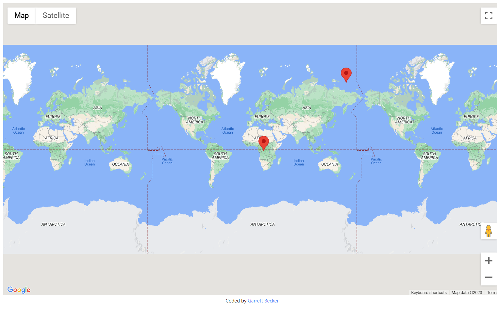

## Design Patterns with TypeScript

### [Live Demo: Map App](https://typescript-map-app.gdbecker.repl.co/)

### Map App Project Overview

- Starting to learn design patterns with TypeScript with a simple map app
- Randomly generate User and Company objects and then plot on a map
- Practice design patterns with the interface and class connection
  - Use an interface to act as a gateway for classes to be able to use specific methods
  - In this project, the Mappable interface specifies which properties and methods User and Company need to have in order to be placed as a marker on the map

### Tools and Packages Used

- faker
- google-maps

### Other Notes

- Use "npx parcel index.html" now since parcel does not need to be installed via npm
- Parcel bundles a .ts file into .js and injects it in the <script> tag where you had the original .ts file
