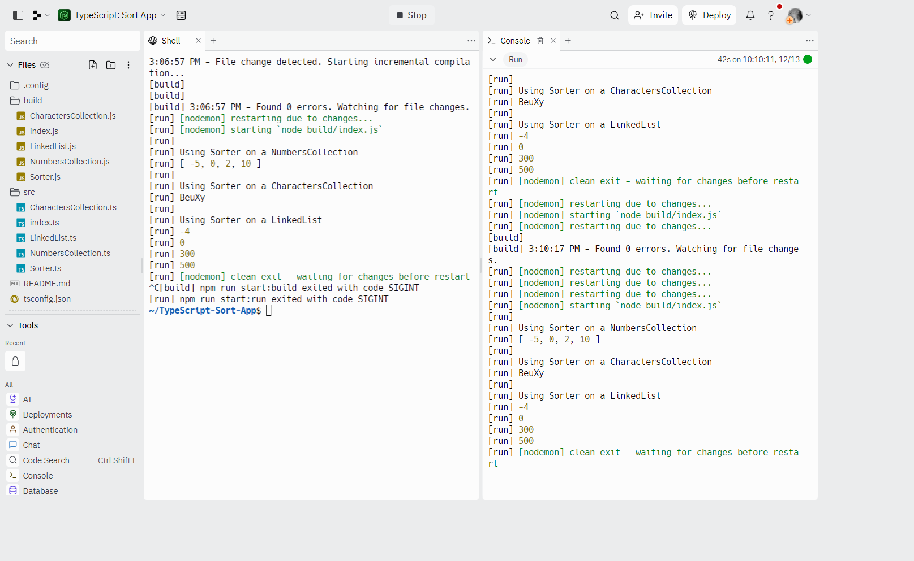

## More on Design Patterns

### [Live Demo: Sorting App](https://replit.com/@gdbecker/TypeScript-Sorting-App)

### Sorting App Project Overview

- Learning more design patterns with interfaces and classes, with this simple sorting app, from least to greatest
- Make one interface to control sorting on multiple types of data structures
- Then refactor Sorter to be an abstract class which the other custom data structures extend from to call their own sort() method

### Tools and Packages Used

- npm packages
  - tsc (compile ts into js)
  - nodemon (executing code once it's compiled)
  - concurrently (run multiple scripts at once)
- Sorting algorithms
  - Bubble Sort

### What are abstract classes?

- Can't be used to create an object directly
- Only used as a parent class
- Can contain real implementation for some methods
- The implemented methods can refer to other methods that don't actually exist yet (we still have to provide names and types for the un-implemented methods)
- Can make child classes promise to implement some other method
  - Use the "abstract" keyword to tell TypeScript that child classes will eventually implement this method

### Interfaces vs Inheritance/Abstract Classes

- Interfaces
  - Sets up a contract between different classes
  - Use when we have very different objects that we want to work together
  - Promotes loose coupling
- Inheritance/Abstract Classes
  - Sets up a contract between different classes
  - Use when we are trying to build up a definition of an object
  - Strongly couples classes together

### Other Notes

- Use "tsc --init" in the terminal to make a "tsconfig.json" file
- rootdir -> './src'
- outdir -> './build'
- Use "tsc -w" in the terminal to open the "watch" mode to detect any changes in the src folder, which will then transform the .ts files into .js files
- Type Guards
  - Use "typeof" for testing if it's a primitive type
  - Use "instanceof" for testing if it's an object, array, map, etc
