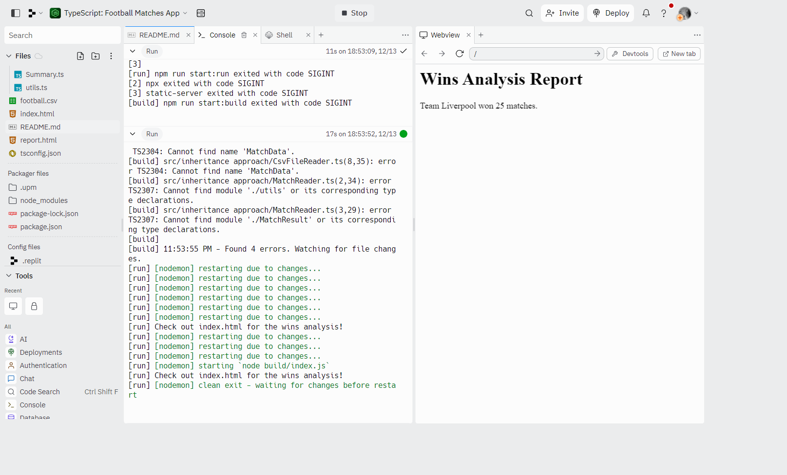

## Reusable Code

### [Live Demo: Football Matches App](https://replit.com/@gdbecker/TypeScript-Football-Matches-App)

### Football Matches App Project Overview

- Load the football.csv file into the project, parse and then analyze what's inside to produce a report
- Used an inheritance approach first, and then refactored into composition for the final design

### Tools and Packages Used

- npm packages
  - tsc (compile ts into js)
  - nodemon (executing code once it's compiled)
  - concurrently (run multiple scripts at once)
- "npm i @types/node" -> install type files for anything in the node standard library

### Enums

- Primary goal: signal to other engineers that these are a collection of closely related values
- Follow near-identical syntax rules as normal objects
- Creates an object with the same keys and values when converted from TS to JS
- Use whenever we have a small, fixed set of values that are all closely related and known at compile time

### Type Assertion

- Type Assertion: override TypeScript's default behavior
  - Ex: row[5] as MatchResult
  - Making sure this value is one of the MatchResult enum values

### Generics

- Like function arguments, but for types in class/function definitions
- Allows us to define the type of a property/argument/return value at a future point
- Used heavily when writing reusable code
- Often denoted as <T>

### Inheritance and Composition comparison

- Inheritance
  - Characterized by an 'is a' relationship between two classes
- Composition
  - Characterized by a 'has a' relationship between two classes

### Other Notes

- Use "tsc --init" in the terminal to make a "tsconfig.json" file
- rootdir -> './src'
- outdir -> './build'
- Use "tsc -w" in the terminal to open the "watch" mode to detect any changes in the src folder, which will then transform the .ts files into .js files
