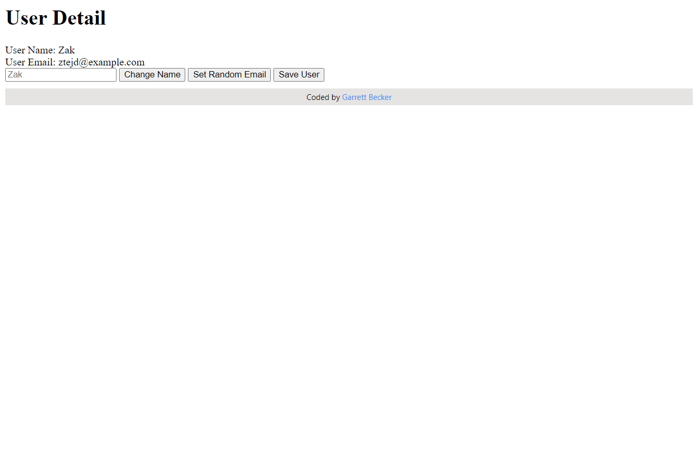

## Let's Build a Web Framework

### [Live Demo: Web Framework](https://typescript-build-a-web-framework.gdbecker.repl.co/)

### Web Framework Project Overview

- Build a totally reusable code base for a custom web framework!
- General structure
  - Model Classes
    - Handle data, used to represent Users, Blog Posts, Images, etc
  - View Classes
    - Handle HTML and events caused by the user (l)
- Extraction Approach
  - Build class User as a 'mega' class with tons of methods
  - Refactor User to use composition
  - Refactor User to be a reusable class that can represent any piece of data, not just a User
- Class User structure goal
  - attributes: Attributes
    - Gives us the ability to store properties tied to this user (like name, email, etc)
  - events: Events
    - Gives us the ability to tell other parts of our application whenever data tied to a particular user is changed
  - sync: Sync
    - Gives us the ability to save this person's data to a remote server, then retrieve it in the future

### Serialize

- Convert data from an object into some save-able format (like .json)

### Deserialize

- Put data on an object using some previously saved data (like .json)

### Tools and Packages Used

- json-server
  - I was not able to use json-server here in Replit (unable to access more than one port) so I used dummy json data from https://jsonplaceholder.typicode.com/users as the "backend" instead
- axios
- parcel
- concurrently

### Other Notes

- Use "npx parcel index.html" now since parcel does not need to be installed via npm
- Parcel bundles a .ts file into .js and injects it in the <script> tag where you had the original .ts file
- In TypeSCript, strings can be keys
- In JavaScript (and therefore TypeScript), all object keys are strings
