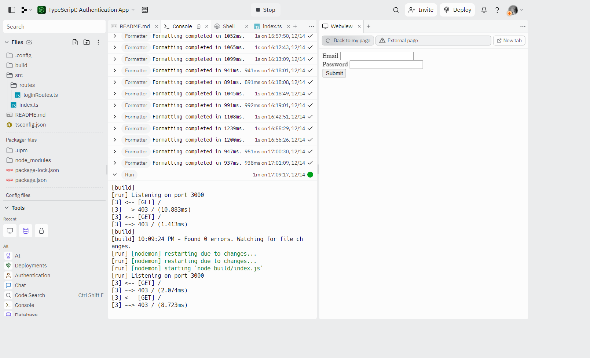

## Express and TypeScript Integration

### [Live Demo: Authentication App V1](https://typescript-authentication-app.gdbecker.repl.co/)

### Authentication App V1 Project Overview

- Simple authentication app with express: log users in to see a page on the protected route, and keep unauthenticated users from seeing that page
- This version is constructed with the minimal amount of type annotations needed, and uses the first approach from "TS with JS Libraries"

### Tools and Packages Used

- npm packages
  - tsc (compile ts into js)
  - nodemon (executing code once it's compiled)
  - concurrently (run multiple scripts at once)
  - express
- "npm i @types/node" -> install type files for anything in the node standard library

### TS with JS Libraries

- Use the library normally, adding in basic type annotations where possible
- Use a TS adapter library that has helpers for using your library with TS
- Twist your library to work with TS classes

### Middleware in Express

- Main goal: investigate a request or response and do some processing on it
- Calls 'NextFunction' when complete

### Integration Issues

- Cons
  - Type definition files alone can't express what is going on in the JS world accurately (such as: middleware)
  - Type definition files provided to us aren't always accurate
  - Inputs to a server (or any program with external inputs) are not guaranteed to exist, or be of the correct type (made worse by type definition files!)
  - The point is that type definition files are not perfect and can cause issues
- Pros
  - Addressing these type issues with TypeScript can force us to write better code

### Other Notes

- Use "tsc --init" in the terminal to make a "tsconfig.json" file
- rootdir -> './src'
- outdir -> './build'
- Use "tsc -w" in the terminal to open the "watch" mode to detect any changes in the src folder, which will then transform the .ts files into .js files
