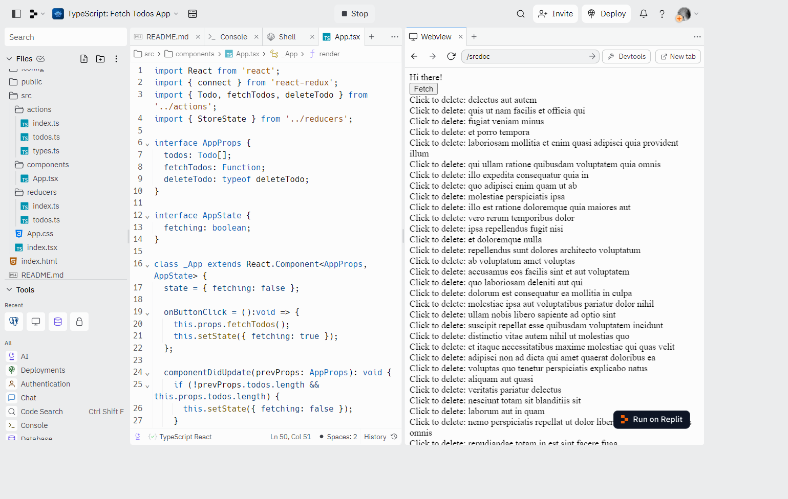

## React and Redux Class Components with TypeScript

### [Live Demo: Fetch Todos App](https://replit.com/@gdbecker/TypeScript-Fetch-Todos-App)

### Fetch Todos App Project Overview

- Simple React app which fetches a list of fake todos from the json placeholder API, displays a loading message as they come in, and lets you delete from the page by clicking on each one
- Combined TypeScript with React and Redux tools to utilize type definitions and annotations

### Tools and Packages Used

- [React](https://reactjs.org/) is a popular JavaScript library for building user interfaces.
- [Vite](https://vitejs.dev/) is a blazing fast frontend build tool that includes features like Hot Module Reloading (HMR), optimized builds, and TypeScript support out of the box.

### Pros and Cons of using TypeScript with React

- Pros
  - Far, far easier to avoid extremely common typos, like incorrect action types
  - Gives developers a far better understanding of the type of data flowing around
  - Much easier to refactor just about everything
- Cons
  - Not the best type definition files (especially around redux)
  - TOns of generics flying around
  - Tons of imports, as just about everything (action creator, action, reducer, store, component) need to be aware of different types
  - Redux inherently functional in nature, tough integration with TypeScript classes
