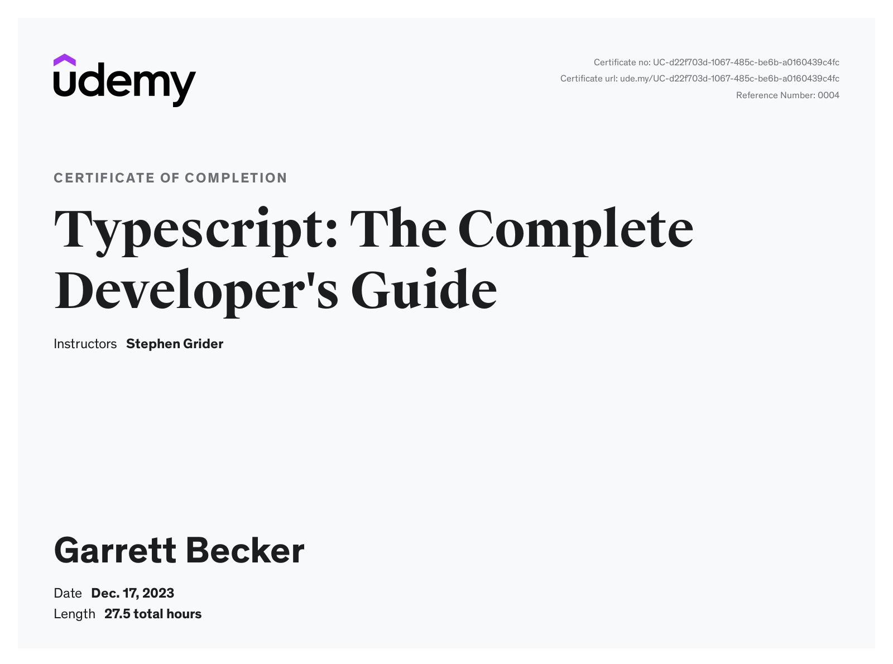

# Udemy - TypeScript: The Complete Developer's Guide

Projects and learning from Stephen Grider's [TypeScript: The Complete Developer's Guide course on Udemy](https://www.udemy.com/course/typescript-the-complete-developers-guide/).

### [Certificate](https://www.udemy.com/certificate/UC-d22f703d-1067-485c-be6b-a0160439c4fc/)

