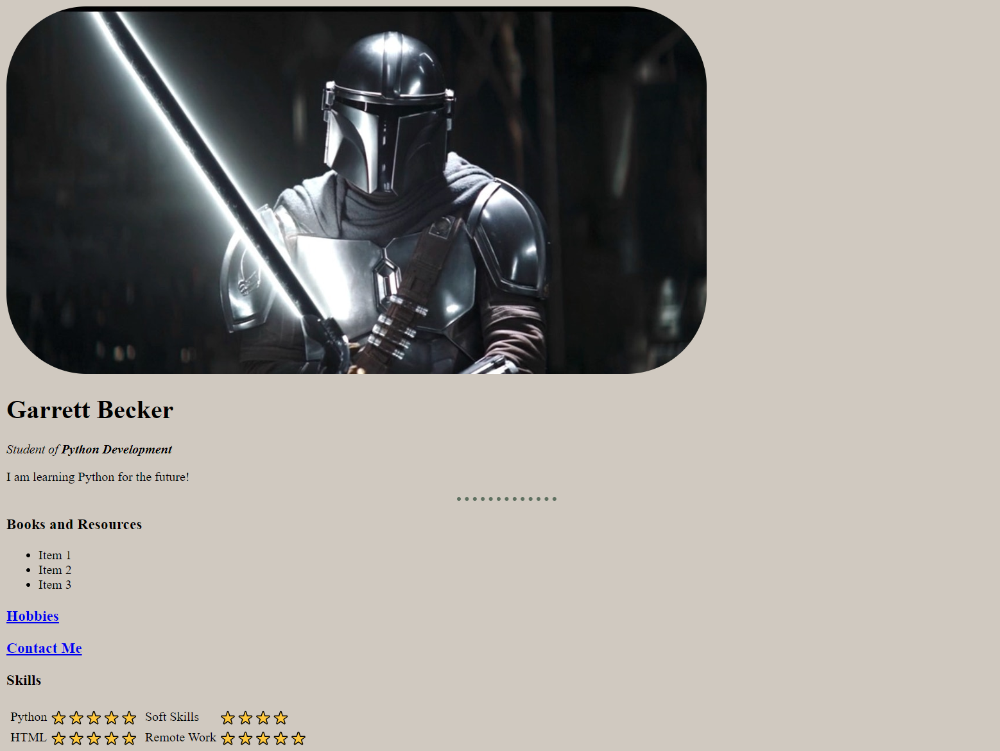

## 04 - Multi-Page Websites

### [Demo: Personal Site](https://py100-041-4-personalsitehtml-gdbecker.netlify.app)

Practicing constructing multi-page websites with a simple personal site. Main landing page with links to a page about hobbies and another for a contact form. Focus is more on HTML structure rather than CSS.

