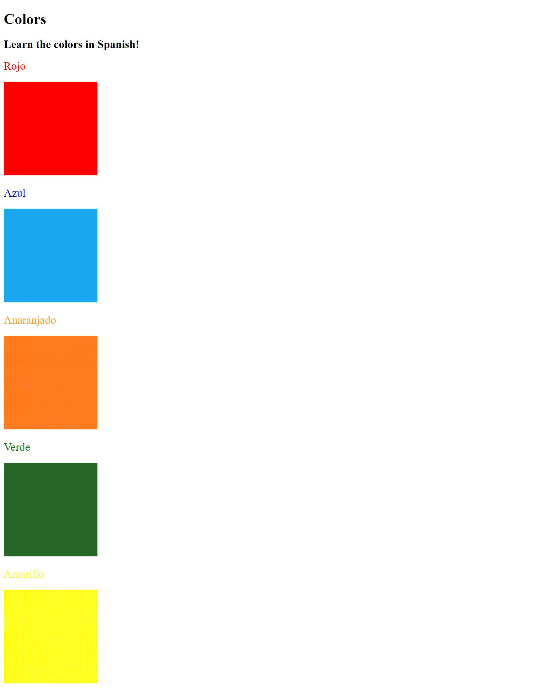

## 05 - Introduction to CSS

### [Demo: Color Vocab Website](https://colorvocabwebsite.gdbecker.repl.co/)

Practice mini project for basic CSS for tags, classes and ids: Spanish color vocab website.

