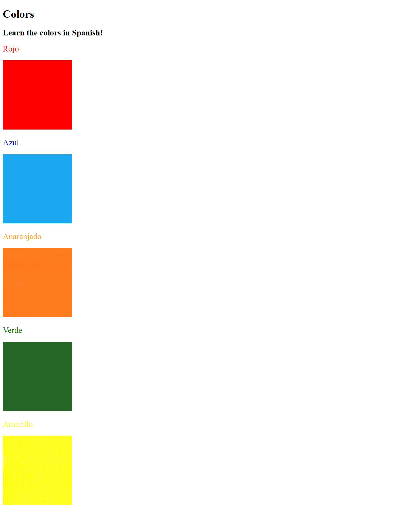

## 05 - Introduction to CSS

### [Demo: Color Vocab Website](https://wdb-color-vocab-site-gdbecker.netlify.app)

Practice mini project for basic CSS for tags, classes and ids: Spanish color vocab website.

