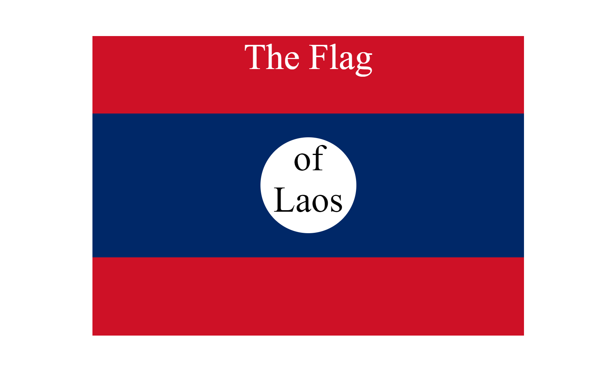

## 07 - Intermediate CSS

### [Demo: CSS Flag](https://csslaosflag.gdbecker.repl.co/)

Practice mini project for basic HTML and CSS: recreate the country flag of Laos.

### Assignment: Recreate the country flag of Laos with CSS

- IMPORTANT! Do not change any HTML
- Don't add any classes/ids/elements
- Use what you know about combining selectors and CSS specificity instead.
- Hint 1: The flag is 900px by 600px and the circle is 200px by 200px.
- Hint 2: You can use CSS inspection to get the colors from https://appbrewery.github.io/flag-of-laos/
