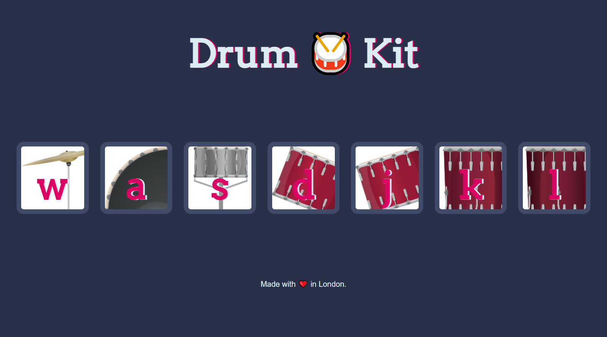

## 18 - Advanced JavaScript and DOM Manipulation

### [Demo: Drum Kit](https://drumkit.gdbecker.repl.co/)

### Drum Kit Project Overview

App to practice DOM manipulation and event listeners for keyboard letters. Based on the key selected, a different drum kit sound will play plus the image will slightly change to show you picked that sound.
