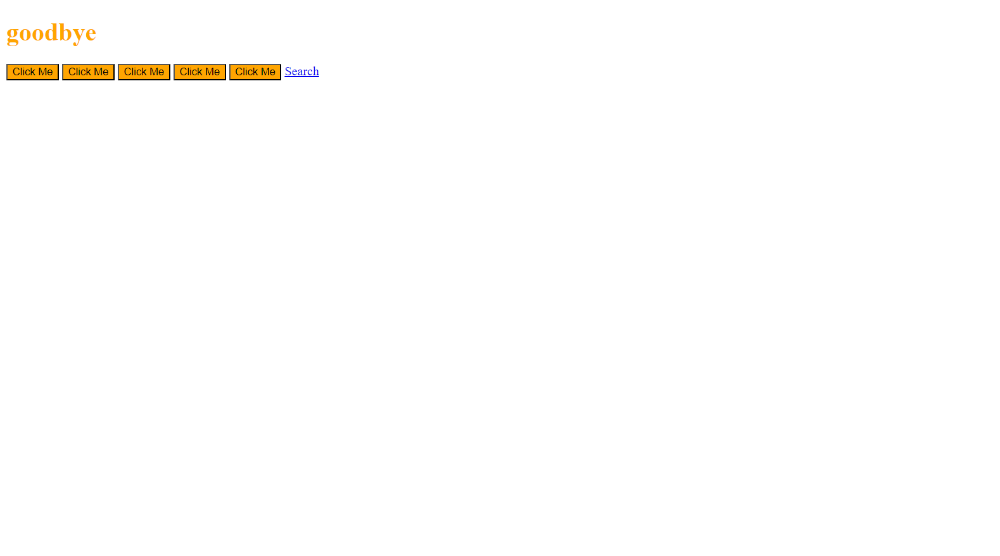

## 19 - jQuery

### [Demo: jQuery Practice](https://replit.com/@gdbecker/jQueryPractice)

Learning jQuery concepts through a small webpage - clicking on any of the buttons will collapse/show the text. Mousing over "goodbye" will change the color from black to orange.

