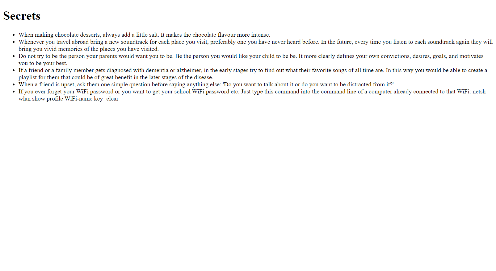
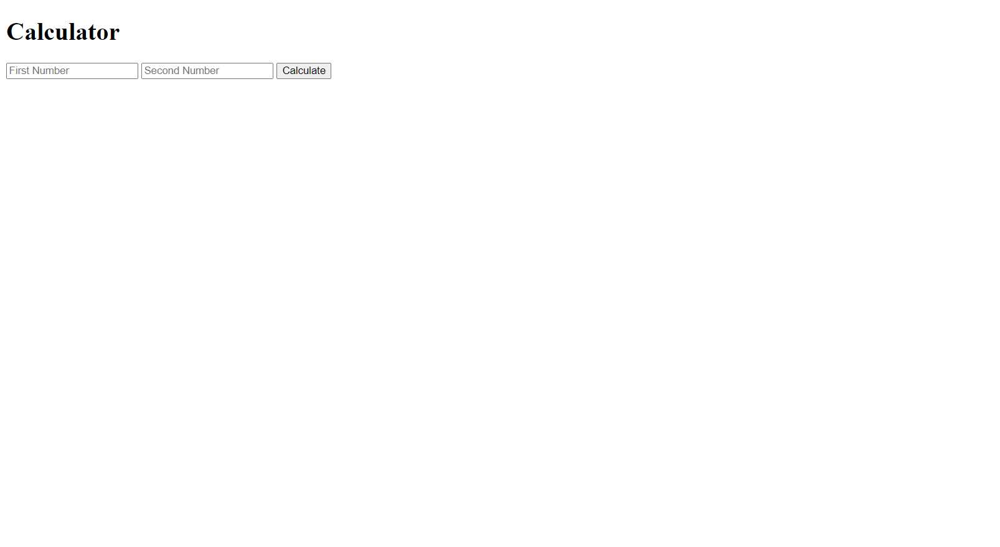
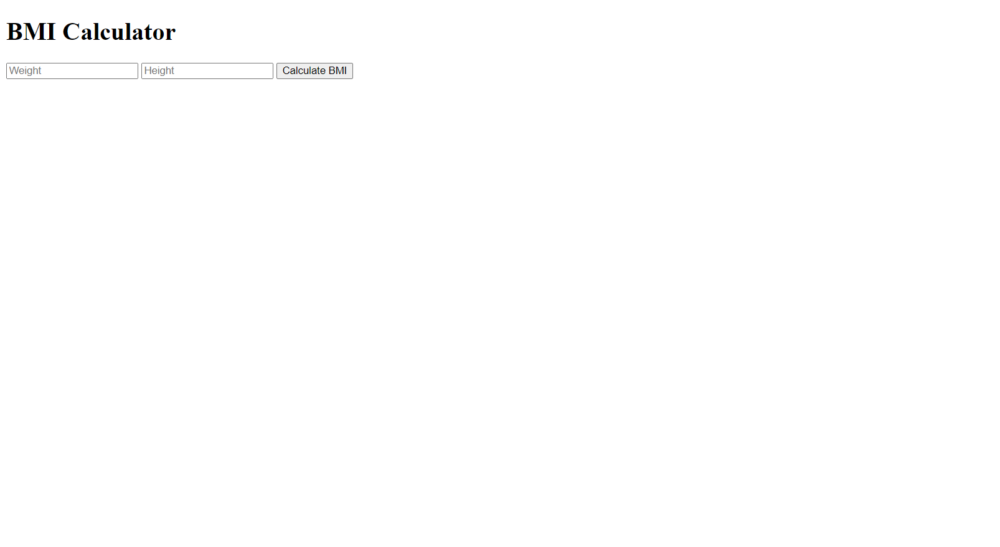
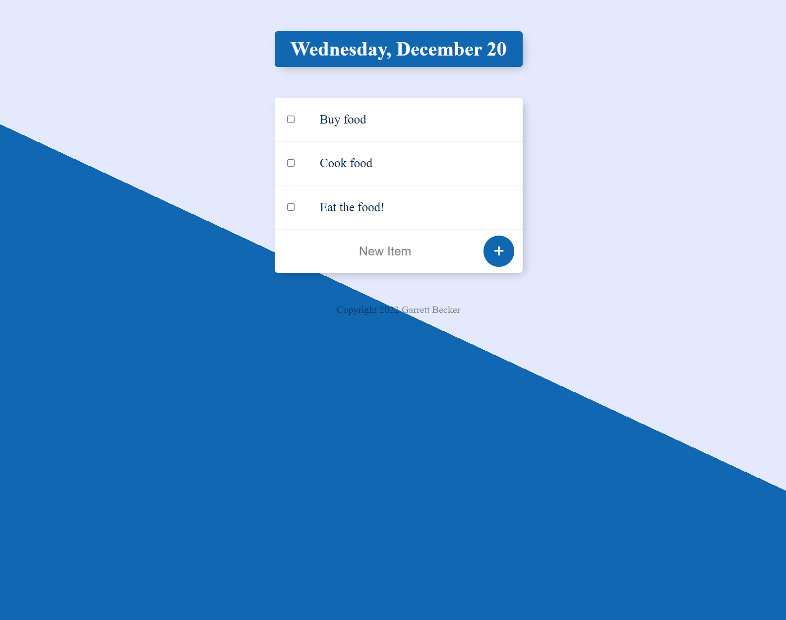

## 24 - Express.js with Node.js

Learning how to use Express.js and Node.js with a series of mini projects.

### [Demo: Secrets Access](https://secretsaccess.gdbecker.repl.co/)

#### Before Password

#### After Password: Secrets

Access a list of secrets after inputting the correct password on the main page. Practiced Express.js and bodyParser.

---

### [Demo: Addition Calculator](https://calculator.gdbecker.repl.co/)

### [Demo: BMI Calculator](https://calculator.gdbecker.repl.co/bmi/)

Simple addition calculator at the root "/" url, or calculate BMI at the "/bmi" route.

---

### [Demo: ToDoList V1](https://todolistv1.gdbecker.repl.co/)

First version of making a to do app in the course.
