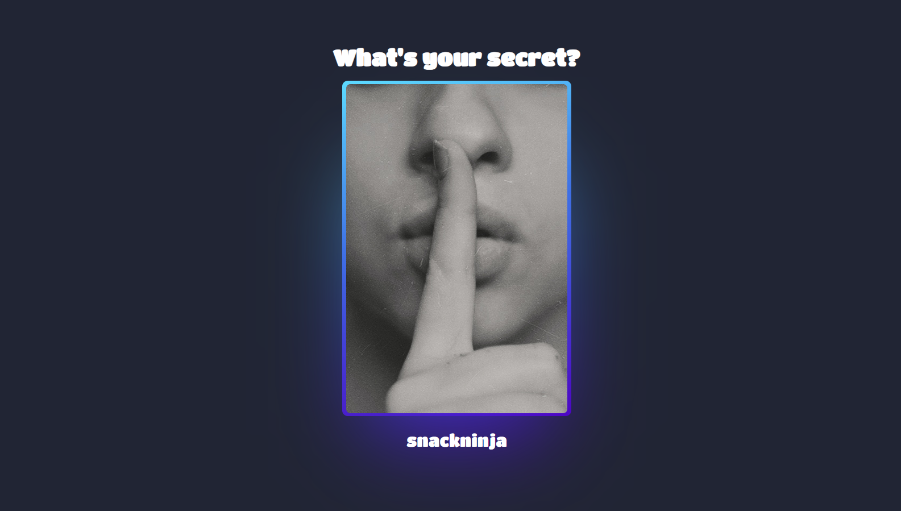

## 28 - Application Programming Interfaces (APIs)

### [Demo: Secrets Project](https://secrets-project-gdbecker.replit.app/)

Web app to practice using Express, Axios, and EJS templating. Pull up a random 'secret' from App Brewery's free API by hovering over the image.

