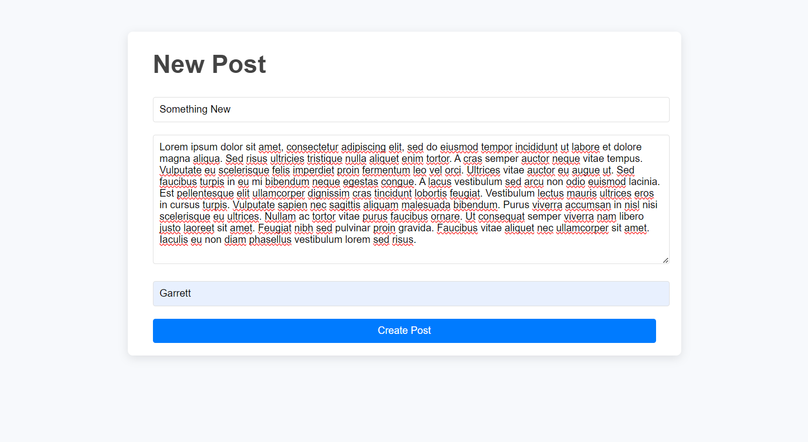

## 30 - Build Your Own API

### What makes an API "RESTful?

- Uses standard HTTP methods
  - GET
  - POST
  - PUT
  - PATCH
  - DELETE
- Has a standard data format it works with, like .json
- Clients and servers are separate
  - Not on the same network or file system
- Stateless
  - Each request from the server should have all the data needed
  - Each request and response is complete, don't need to know what happened previously
- Resource-based
  - Centered around resources, and has a URI to locate them

---

### [Demo: Build a Blog API](https://blogapi.gdbecker.repl.co/)

#### Home Page

#### Before adding a new post

#### Writing a new post

#### View all posts including the new one

#### Editing an existing post

#### View all again with edited post

### Project Overview

Built our own API for a blog website: GET all posts, GET a specific POST, PATCH an existing post, or delete one. Each blog has a title, main body, and author.
