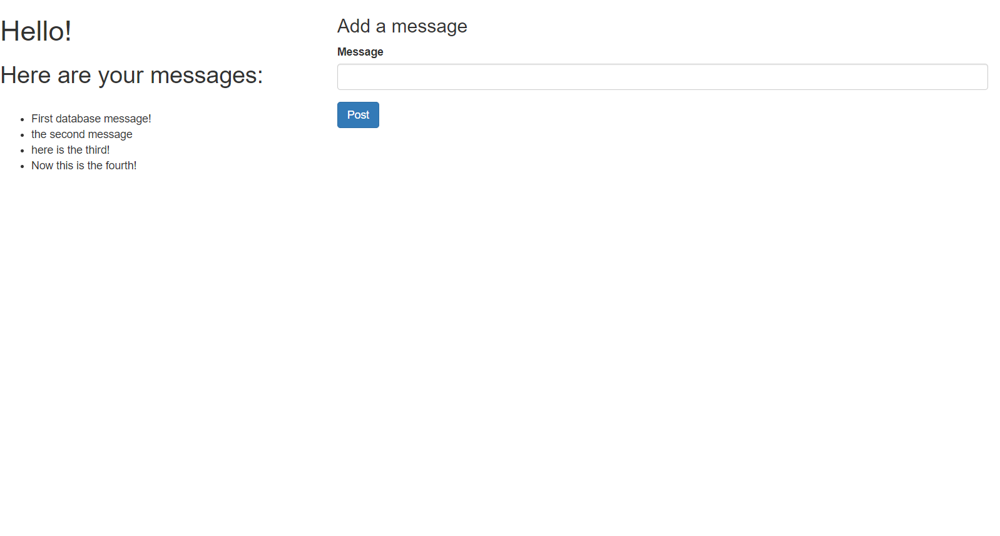
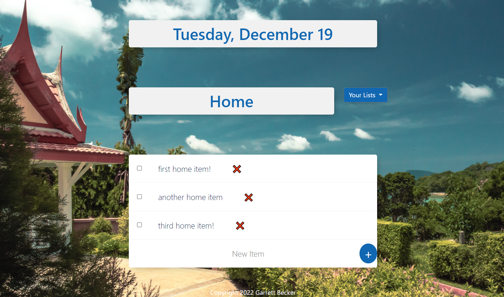

## 31 - Databases

### Database Mini Projects

#### SQLitePractice

Output simple messages from the database in list elements, and add a new one with the form.

[Demo](https://sqlitepractice.gdbecker.repl.co/)

#### ToDoList V2

ToDoList web app with an SQLite database backend. Add items to multiple lists and dynamically select which list to add items to, and delete with the red x.

[Demo](https://todolistv2.gdbecker.repl.co/)

#### Wiki App

Made a simple API with a couple of GET endpoints, for receiving all articles or a specific article by title

[Demo](https://wikiapp.gdbecker.repl.co/articles)

