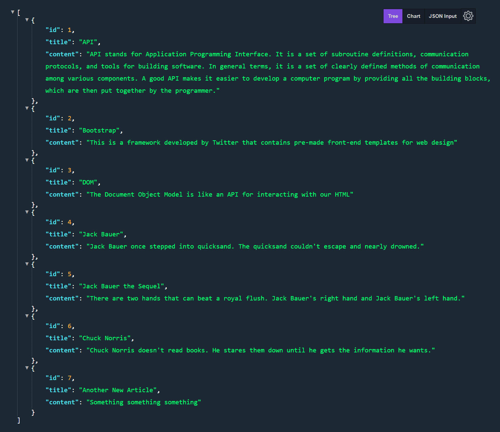

## 32 - SQL

### Database Mini Project

#### Wiki App

Made a simple API with a couple of GET endpoints, for receiving all articles or a specific article by title

[Demo: Wiki App](https://wikiapp.gdbecker.repl.co/articles)

