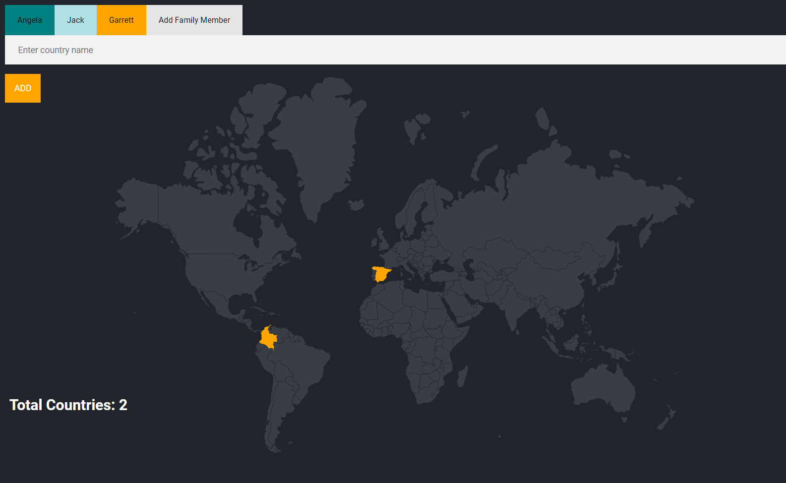
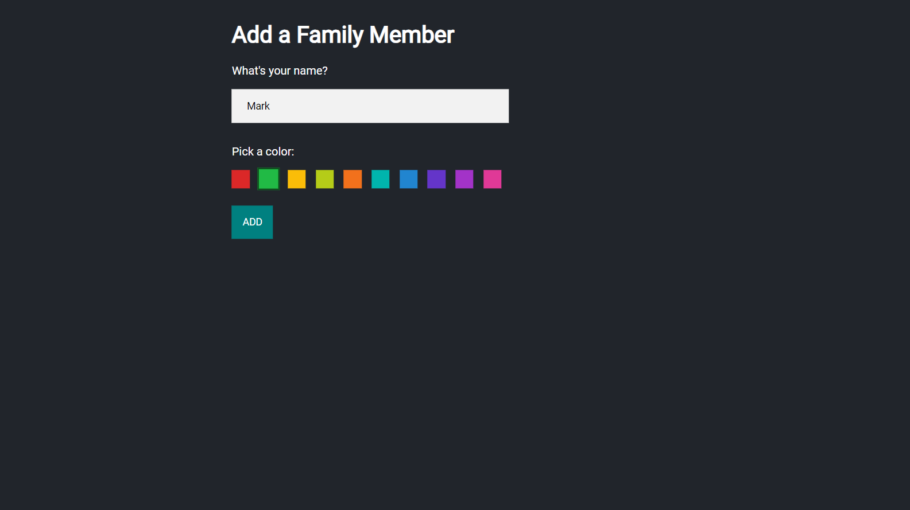
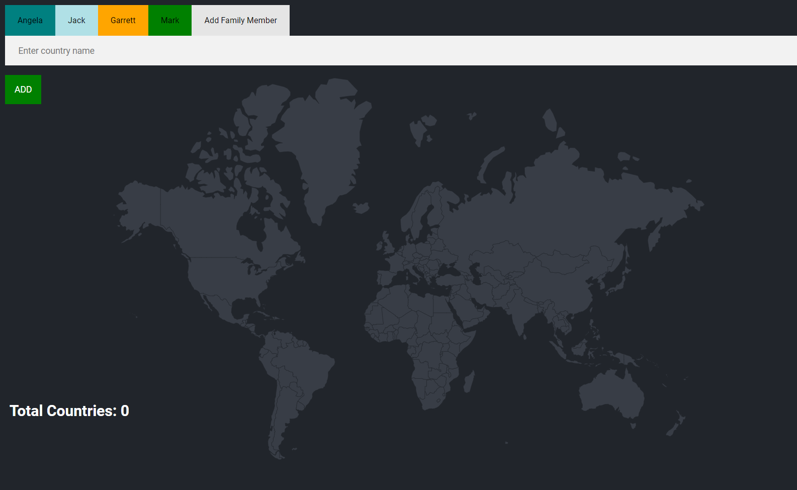

## Family Travel Tracker Project

### [Demo: Family Travel Tracker](https://family-travel-tracker-gdbecker.replit.app/)

Practiced using a PostgreSQL database and modifying another engineer's existing code for this family travel tracker project. This is an extension of the previous "TravelTracker" project to be able to view other family members' countries they have traveled to. The aim here was to examine existing code to add additional functionality (adding a new user, viewing countries by a specific user, and adding a newly visited country to a specific user) and query needed data from the PostgreSQL database.

Note: For deployment I used an SQLite database since Replit's costs for using one of their PostgreSQL databases connected to Neon was too expensive. Check out the specific [Index PostgreSQL.js](./index%20postgresql.js) file for PostgreSQL configuration.

#### Home page before adding a new family member

#### Adding a new family member

#### View new family member page

