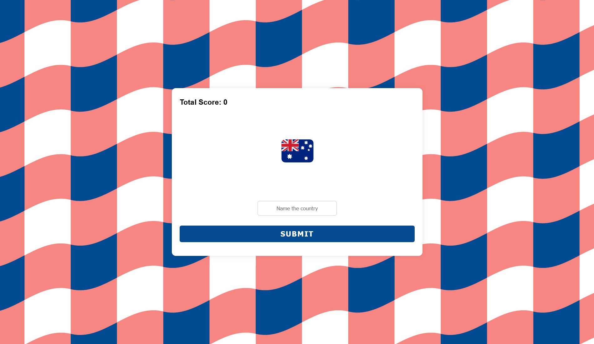

## Flags Quiz Mini Project

### [Demo: Flags Quiz](https://flags-mini-project-gdbecker.replit.app/)

Practiced using a PostgreSQL database with a flags quiz project. The frontend and most of the backend was already done, so the aim here was to learn how to import csv data into the database and get the app connected.

Note: For deployment I used an SQLite database since Replit's costs for using one of their PostgreSQL databases connected to Neon was too expensive. Check out the specific [Index PostgreSQL.js](./index%20postgresql.cjs) file for PostgreSQL configuration.

