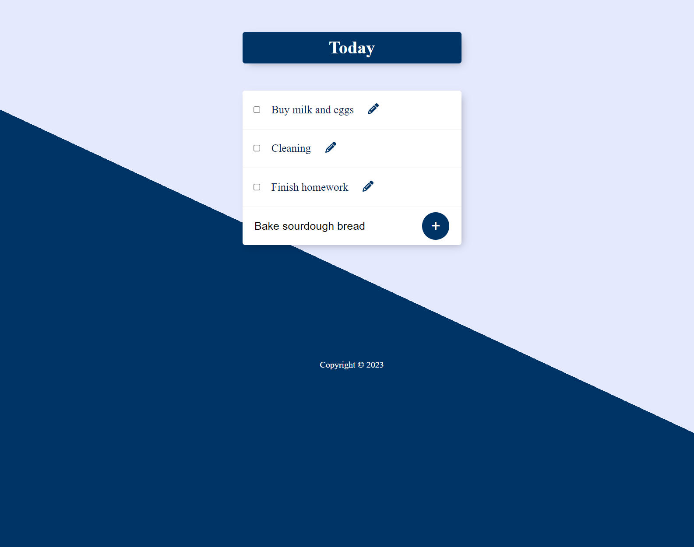
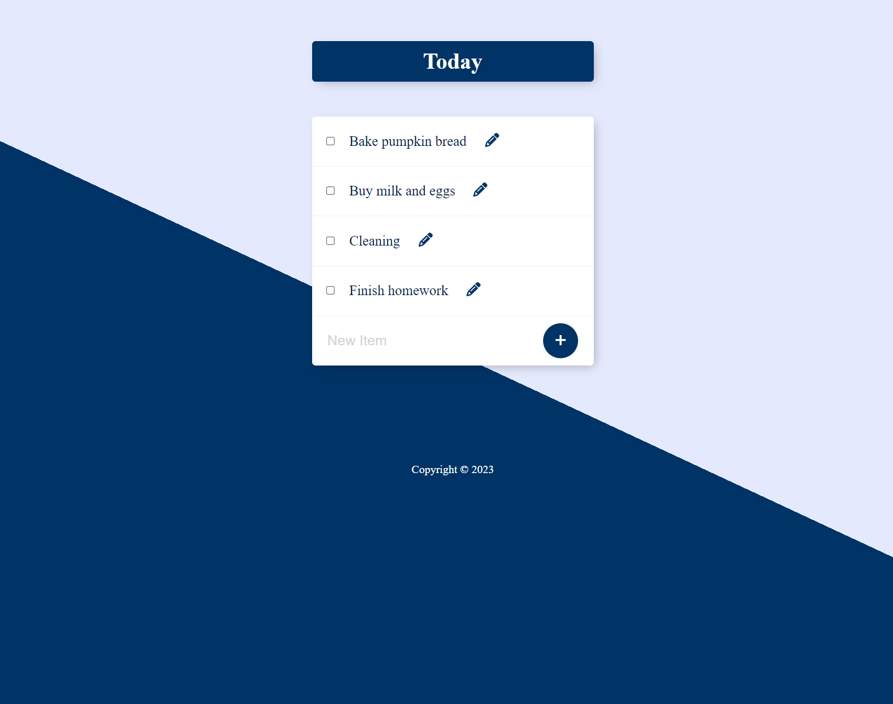

## Permalist Project

### [Demo: Permalist Project](https://permalistproject.gdbecker.repl.co/)

Practiced using a PostgreSQL database and modifying another engineer's existing code for this "Permalist" permanent list todo project. The aim here was to examine existing code to add additional functionality:

- Viewing all todos
- Adding a new item and persist to the database
- Editing any todo
- Deleting a todo by clicking the checkbox.

#### Home page before adding a new todo item

#### Adding a new todo

#### Edit the newest todo

#### View all todos

