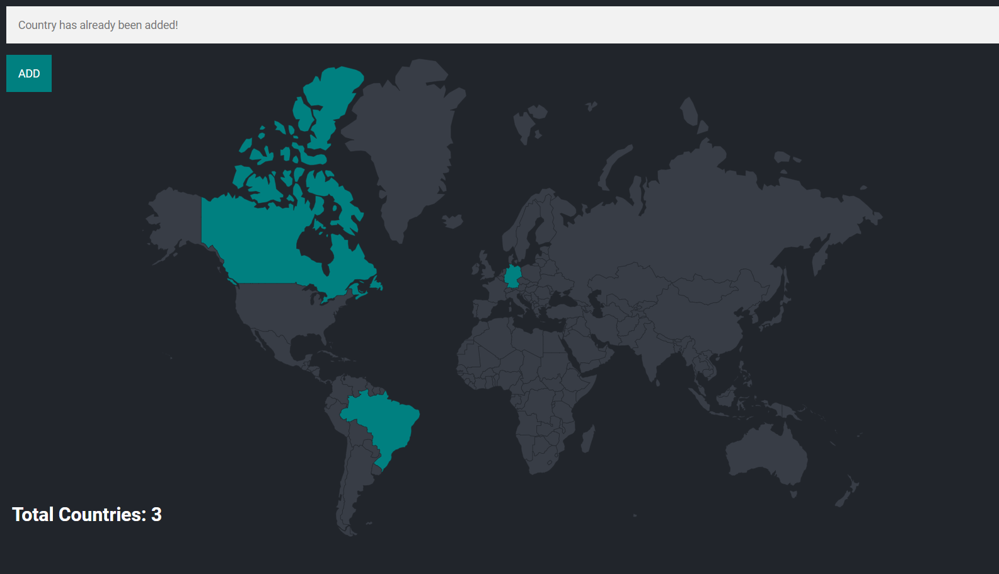

## Travel Tracker Project

### [Demo: Travel Tracker](https://travel-tracker-gdbecker.replit.app/)

Practiced using a PostgreSQL database with the travel tracker project. The frontend and most of the backend was already done, so the aim here was to learn how to import multiple csv files into the database, pull all visited countries and inject into the .ejs file, and handle the add form submit to insert a new visited country.

Note: For deployment I used an SQLite database since Replit's costs for using one of their PostgreSQL databases connected to Neon was too expensive. Check out the specific [Index PostgreSQL.js](./index%20postgresql.js) file for PostgreSQL configuration.

