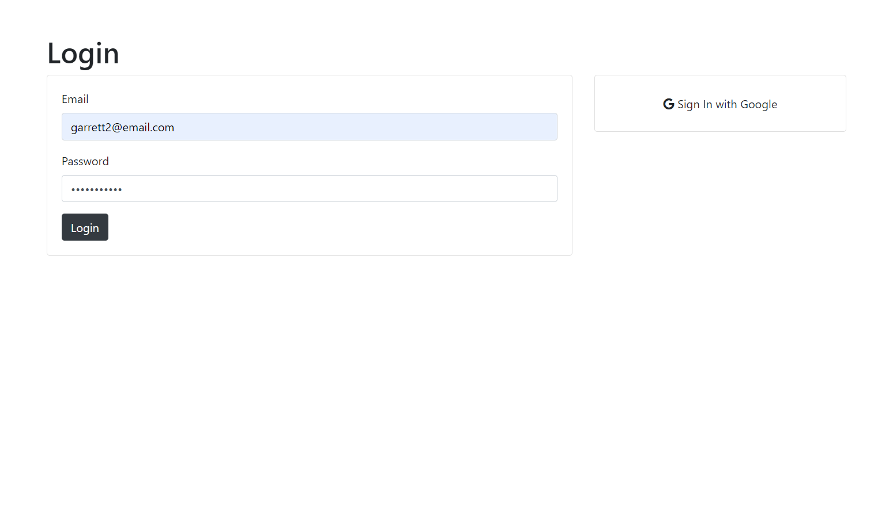
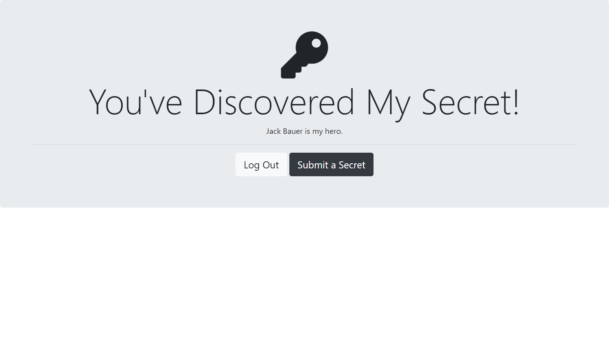

## 35 - Authentication and Security

### [Demo: Authentication](https://authenticationapp.gdbecker.repl.co/)

Followed along with Angela to make a simple app to authenticate users to view a "secrets" page. Uses Passport and express-sessions, Google sign-in capability, and an SQLite database to persist users' info. Hashes all passwords with a salt.

#### Home Page

#### Login Page

#### Secrets Page

