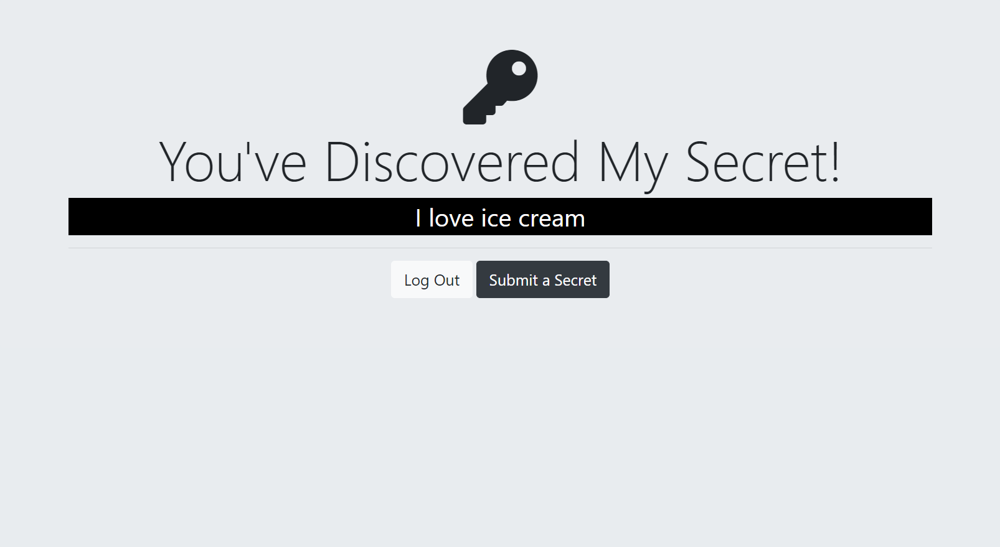

## Secrets App - Old Version with SQLite

### [Demo: Secrets App](https://replit.com/@gdbecker/Secrets-App-V2)

Followed along with Angela to make a simple app to authenticate users to view a "secrets" page. Uses Passport and express-sessions, Google sign-in capability, and a PostgreSQL database to persist users' info. Hashes all passwords with a salt.

Username: example@email.com
Password: Password

#### Home Page

#### Login Page

#### Secrets Page Before Submit

#### Submit Page

#### Secrets Page After Submit

