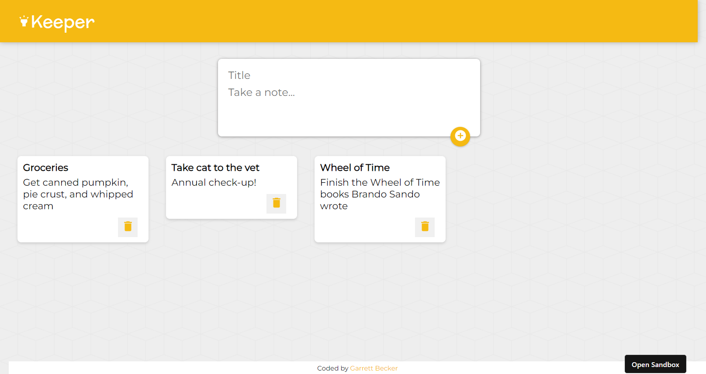

## 36 - React.js

Series of React.js mini projects to learn core concepts - all culminating in the final project: the Keeper App!

### [Keeper App](./Keeper-App/)

### Mini Projects

- [Introduction to JSX](./01.0-Introduction-to-JSX/)
- [JSX Code Challenge](./01.5-JSX-Code-Challenge/)
- [Javascript Expressions in JSX](./02.0-Javascript-Expressions-in-JSX/)
- [Javascript Expressions in JSX - Practice](./02.5-Javascript-Expressions-in-JSX-Practice/)
- [JSX Attributes and Styling](./03.0-JSX-Attributes-and-Styling/)
- [Inline Styling in JSX](./03.0-Inline-Styling-in-JSX/)
- [React Styling Practice](./03.5-React-Styling-Practice/)
- [React Components](./04.0-React-Components/)
- [React Components Practice](./04.5-React-Components-Practice/)
- [ES6 Import, Export and Modules](./05.0-ES6-Import-Export-and-Modules/)
- [ES6 Import and Export Practice](./05.5-ES6-Import-Export-Practice/)
- [React Props](./06.0-React-Props/)
- [React Props Practice](./06.5-React-Props-Practice/)
- [React Devtools](./07.0-React-Devtools/)
- [Mapping Components](./07.0-Mapping-Components/)
- [Mapping Components Practice](./07.5-Mapping-Components-Practice/)
- [Map, Filter, and Reduce](./08.0-Map-Filter-Reduce/)
- [ES6 Arrow Functions](./09.0-ES6-Arrow-Functions/)
- [Conditional Rendering](./10-Conditional-Rendering/)
- [Conditional Rendering Practice](./10.5-Conditional-Rendering-Practice/)
- [Introduction to State Completed](./11-Introduction-to-State-Completed/)
- [useState Hook](./12-useState-Hook/)
- [useState Hook Practice](./12.5-useState-Hook-Practice/)
- [ES6 Destructuring](./13-ES6-Destructuring/)
- [Event Handling in React](./14-Event-Handling-in-React/)
- [React Forms](./15-React-Forms/)
- [Changing Complex State](./16-Changing-Complex-State/)
- [Changing Complex State Practice](./16.5-Changing-Complex-State-Practice/)
- [ES6 Spread Operator](./17-ES6-Spread-Operator/)
- [ES6 Spread Operator Practice](./17.5-ES6-Spread-Operator-Practice/)
- [Managing a Component Tree](./18-Managing-a-Component-Tree/)
- [Managing a Component Tree Practice](./18.5-Managing-a-Component-Tree-Practice/)
